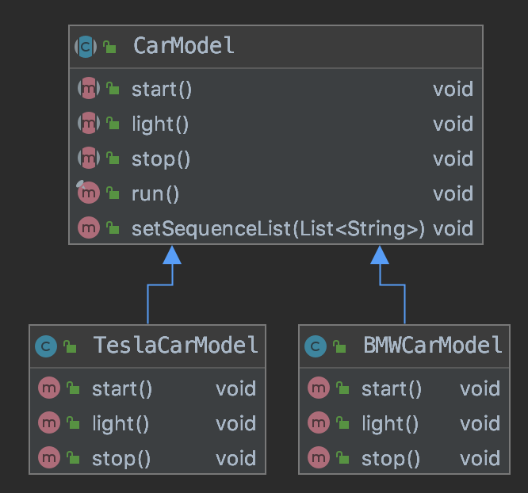

## 09. 建造者模式、模板模式、适配器模式与外观模式
### 1. 建造者模式（相比工厂模式，更加关注产品的具体细节，即在不新增类的条件下实现内部细节定制）
#### 1. 引入（为什么要使用建造者模式）
假设一个玩具模型厂家，需要为不同的客户生成不同的小汽车模型(具体产品细节需要定制)，A客户要求模型先跑，然后亮灯，最后停止。B客户要求先亮灯，然后跑，最后停止。    
首先能想到的就是从产品类入手，抽象产品类定义一系列需要子类实现的抽象方法，具体方法由子类实现，并定义一个List作为定制序列，由外部传入。对应的类图如下：  
  
对应的代码：
1. 顶层产品类（抽象产品类）：   
    ```java
    public abstract class CarModel {
    
        private List<String> sequenceList = new ArrayList<String>();
    
        public abstract void start();
    
        public abstract void light();
    
        public abstract void stop();
    
        public final void run(){
            for (String s : sequenceList) {
                if(s.equals("start")){
                    this.start();
                }else if(s.equals("light")){
                    this.light();
                }else if(s.equals("stop")){
                    this.stop();
                }
            }
        }
    
        public void setSequenceList(List<String> sequenceList) {
            this.sequenceList = sequenceList;
        }
    }
    ```
1. 具体产品类A： 
    ```java
    public class BMWCarModel extends CarModel {
        @Override
        public void start() {
            System.err.println("BMW car model starting...");
        }
    
        @Override
        public void light() {
            System.err.println("BMW car lights on...");
        }
    
        @Override
        public void stop() {
            System.err.println("BMW car stopped...");
        }
    }
    ```
1. 具体产品类B： 
    ```java
    public class TeslaCarModel extends CarModel {
        @Override
        public void start() {
            System.err.println("Tesla car model is starting...");
        }
    
        @Override
        public void light() {
            System.err.println("Tesla car model lights on...");
        }
    
        @Override
        public void stop() {
            System.err.println("Tesla car model stopped...");
        }
    }
    ```
1. 客户类：  
    ```java
    public class Client {
    
        public static void main(String[] args) {
            List<String> sequenceList = new ArrayList<String>();
            sequenceList.add("start");
            sequenceList.add("light");
            sequenceList.add("stop");
            CarModel carModel = new BMWCarModel();
            carModel.setSequenceList(sequenceList);
            carModel.run();
            
            sequenceList.clear();
            sequenceList.add("light");
            sequenceList.add("start");
            sequenceList.add("stop");
            carModel = new TeslaCarModel();
            carModel.setSequenceList(sequenceList);
            carModel.run();
        }
    }
    ```
1. 控制台输出：  
    ```text
    BMW car model starting...
    BMW car lights on...
    BMW car stopped...
    Tesla car model lights on...
    Tesla car model is starting...
    Tesla car model stopped...
    ```  
至此，我们基本满足了需求。
#### 2. 改造（）
 
#### 3.
 
#### 4. 

### 1. 模板模式
### 1. 适配器模式
### 1. 外观模式

### 1. 其他
1. 工厂方法模式VS建造者模式  
    工厂方法模式注重的是整体对象的创建方法，而建造者模式注重的是部件构建的过程，旨在通过一步一步地精确构造创建出一个复杂的对象。

### 1. 引用
> [第11章　建造者模式](https://www.kancloud.cn/sstd521/design/193534)
> 设计模式之禅