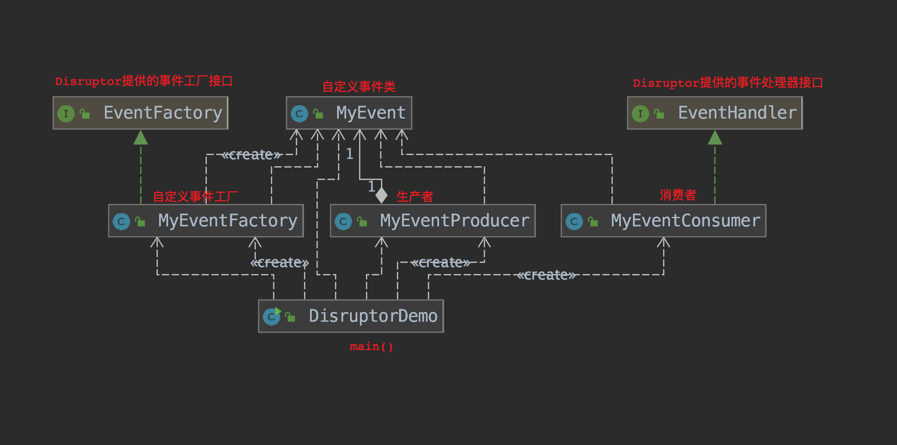
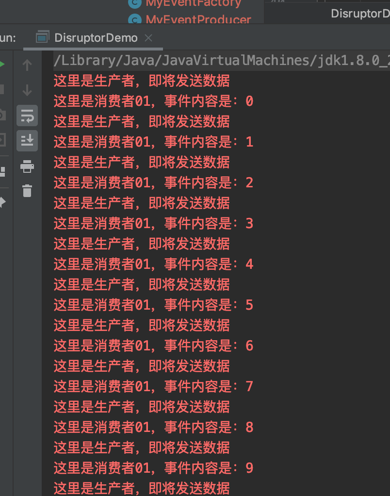

## 06. 并发编程框架Disruptor
### 01.什么是Disruptor
Disruptor是一个高性能的异步处理框架，或者可以认为是最快的消息框架（轻量的JMS），也可以认为是一个观察者模式的实现，或者事件监听模式的实现。
可以理解为他是一种高效的"生产者-消费者"模型。也就性能远远高于传统的BlockingQueue容器。  

### 02. Disruptor的设计方案
1. 环形数组结构：  
为了避免垃圾回收，采用数组而非链表（数组对处理器的缓存机制更加友好）。
1. 元素位置定位：  
数组长度2^n，通过位运算，加快定位的速度。下标采取递增的形式。不用担心index溢出的问题。index是long类型，即使100万QPS的处理速度，也需要30万年才能用完。
1. 无锁设计：  
每个生产者或者消费者线程，会先申请可以操作的元素在数组中的位置，申请到之后，直接在该位置写入或者读取数据（整个过程通过原子变量CAS保证操作的线程安全，
CAS是CPU级别的指令，更加轻量，不必像锁一样需要操作系统提供支持，所以每次调用不需要在用户态与内核态之间切换，也不需要上下文切换）。

### 03. Disruptor的核心概念
1. RingBuffer:  
Disruptor底层数据结构实现，核心类，是线程间交换数据的中转地；
1. SequenceDisruptor:  
序号管理器，负责消费者/生产者各自序号、序号栅栏的管理和协调；
1. Sequence:  
序号，声明一个序号，用于跟踪ringbuffer中任务的变化和消费者的消费情况；
1. SequenceBarrier:  
序号栅栏，管理和协调生产者的游标序号和各个消费者的序号，确保生产者不会覆盖消费者未来得及处理的消息，确保存在依赖的消费者之间能够按照正确的顺序处理；
1. EventProcessor:  
事件处理器，监听RingBuffer的事件，并消费可用事件，从RingBuffer读取的事件会交由实际的生产者实现类来消费；它会一直侦听下一个可用的序号，直到该序号对应的事件已经准备好。
1. EventHandler:  
业务处理器，是实际消费者的接口，完成具体的业务逻辑实现，第三方实现该接口；代表着消费者。
1. Producer:  
生产者接口，第三方线程充当该角色，producer向RingBuffer写入事件。
1. Wait Strategy:  
定义 Consumer 如何进行等待下一个事件的策略（Disruptor针对不同场景定义了不同的等待策略）。
1. Event：  
在 Disruptor 的语义中，生产者和消费者之间进行交换的数据被称为事件(Event)。它不是一个被 Disruptor 定义的特定类型，而是由 Disruptor 的使用者定义并指定。

### 04. 案例：使用Disruptor实现生产与消费(相关代码放置在disruptor包下)
1. 全局结构概览：   

1. 添加maven依赖：
    ```xml
    <dependency>
        <groupId>com.lmax</groupId>
        <artifactId>disruptor</artifactId>
        <version>3.4.2</version>
    </dependency>
    ```
1. 定义Event事件：
    ```java
    public class MyEvent {
    
        private String content;
    
        // getter、setter
    }
    ```  
1. 实现自定义工厂：
    ```java
    public class MyEventFactory implements EventFactory<MyEvent> {
    
        @Override
        public MyEvent newInstance() {
            return new MyEvent();
        }
    }
    ```
1. 实现自定义生产者：
    ```java
    public class MyEventProducer {
        private final RingBuffer<MyEvent> ringBuffer;
    
        public MyEventProducer(RingBuffer<MyEvent> ringBuffer) {
            this.ringBuffer = ringBuffer;
        }
    
        public void onData(String value){
            //  1. 拿到ringBuffer事件队列的下一个槽位置
            long next = ringBuffer.next();
            try {
                // 2. 根据位置获取事件
                MyEvent myEvent = ringBuffer.get(next);
                // 3. 获取事件队列传递的数据
                myEvent.setContent(value+"");
                Thread.sleep(10);
            } catch (Exception e) {
                e.printStackTrace();
            }finally {
                System.err.println("这里是生产者，即将发送数据");
    //            4. 发布事件
                ringBuffer.publish(next);
            }
        }
    }
    ```
1. 实现自定义消费者：
    ```java
    public class MyEventConsumer implements EventHandler<MyEvent> {
        @Override
        public void onEvent(MyEvent event, long sequence, boolean endOfBatch) throws Exception {
            System.err.println("这里是消费者01，事件内容是："+event.getContent());
        }
    }
    ```
1. main():
    ```java
    public class DisruptorDemo {
    
        public static void main(String[] args) {
    //        1. 创建一个可缓存线程池
            ExecutorService threadPool = Executors.newCachedThreadPool();
    //        2. 创建事件工厂
            MyEventFactory myEventFactory = new MyEventFactory();
    //        3. 定义ringBuffer大小
            int ringBufferSize=1024 * 1024;
    //        4. 创建Disruptor
            Disruptor<MyEvent> disruptor = new Disruptor<MyEvent>(myEventFactory, ringBufferSize, threadPool, ProducerType.SINGLE, new YieldingWaitStrategy());
    //        5. 注册消费者
            disruptor.handleEventsWith(new MyEventConsumer());
            disruptor.handleEventsWith(new MyEventConsumer2());
    //        6. 启动
            disruptor.start();
    //        7. 创建RingBuffer容器
            RingBuffer<MyEvent> ringBuffer = disruptor.getRingBuffer();
    //        8. 创建生产者
            MyEventProducer myEventProducer = new MyEventProducer(ringBuffer);
    //        9. 指定缓冲区大小：8
            ByteBuffer byteBuffer = ByteBuffer.allocate(8);
            for (int i = 0; i < 20; i++) {
                myEventProducer.onData(i+"");
            }
    //        10. 关闭
            disruptor.shutdown();
            threadPool.shutdown();
        }
    }
    ```
1. 效果：  


>参考  
>[高性能队列——Disruptor](https://tech.meituan.com/2016/11/18/disruptor.html)