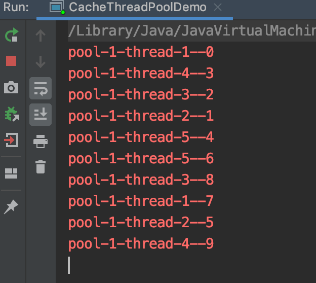
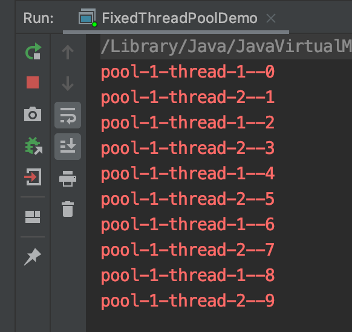
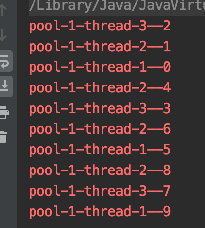
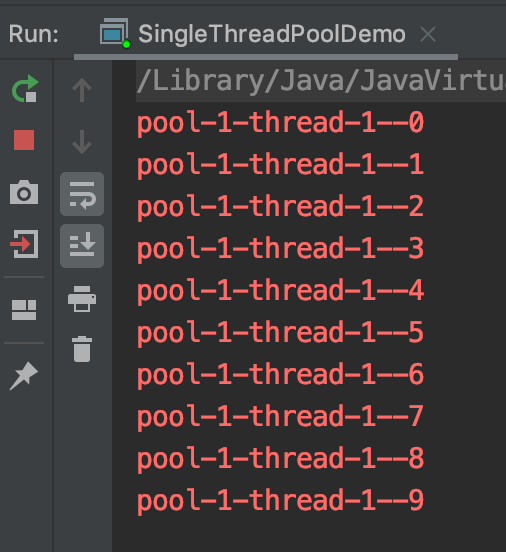
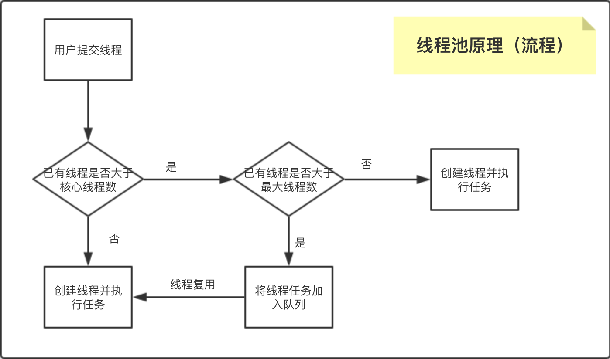
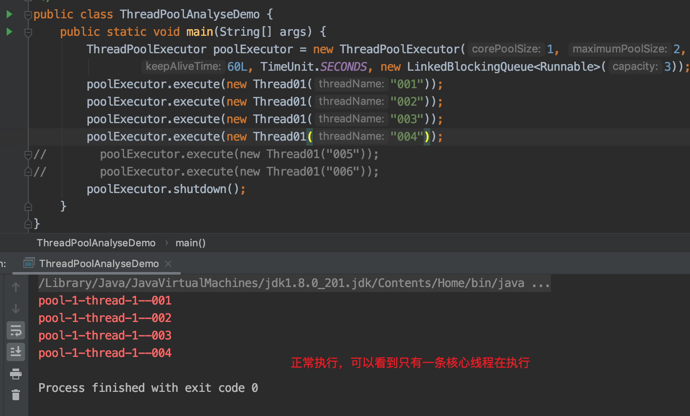
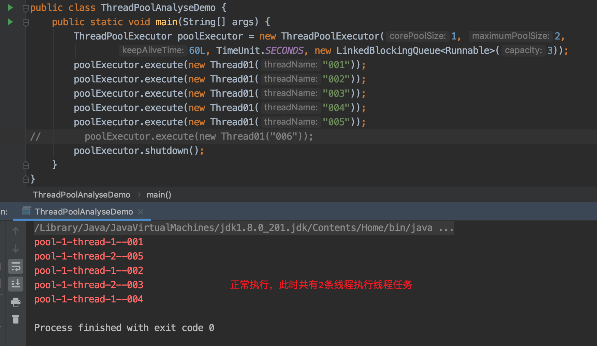
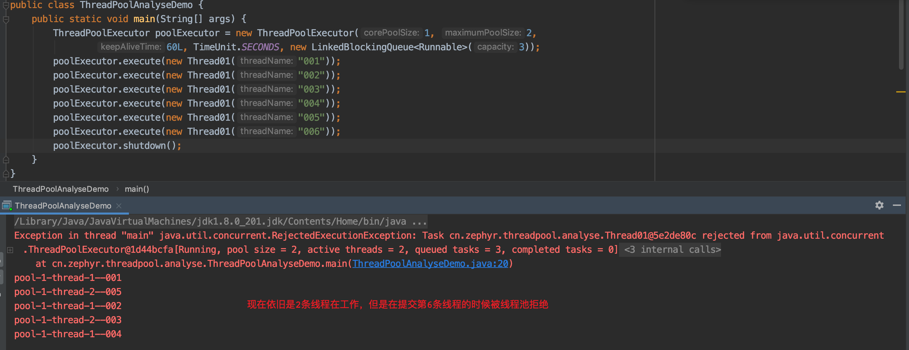

## 04. 线程池原理分析
### 1. 并发队列
1. 队列：先进先出（FIFO:first in first out）
1. 在并发队列上JDK提供了两套实现，一个是以ConcurrentLinkedQueue为代表的高性能非阻塞队列，一个是以BlockingQueue接口为代表的阻塞队列，两者都继承自Queue
1. 阻塞队列与普通队列的区别在于，当队列是空的时，从队列中获取元素的操作将会被阻塞，或者当队列是满时，往队列里添加元素的操作会被阻塞。
试图从空的阻塞队列中获取元素的线程将会被阻塞，直到其他的线程往空的队列插入新的元素。
同样，试图往已满的阻塞队列中添加新元素的线程同样也会被阻塞，直到其他的线程使队列重新变得空闲起来，如从队列中移除一个或者多个元素，或者完全清空队列.
1. 常用的队列：
    1. ArrayDeque, （数组双端队列） 
    1. PriorityQueue, （优先级队列） 
    1. ConcurrentLinkedQueue, （基于链表的并发队列） 
    1. DelayQueue, （延期阻塞队列）（阻塞队列实现了BlockingQueue接口） 
    1. ArrayBlockingQueue, （基于数组的并发阻塞队列） 
    1. LinkedBlockingQueue, （基于链表的FIFO阻塞队列） 
    1. LinkedBlockingDeque, （基于链表的FIFO双端阻塞队列） 
    1. PriorityBlockingQueue, （带优先级的无界阻塞队列） 
    1. SynchronousQueue（并发同步阻塞队列）
1. 阻塞式队列的案例：使用BlockingQueue模拟生产者与消费者
    1. 需求:生产者线程生产数据并存入队列，消费者线程从队列中消费数据
    1. 代码： 
        ```java
        public class BlockingQueueDemo {
            public static void main(String[] args) throws InterruptedException {
                BlockingQueue<String> blockingQueue = new LinkedBlockingDeque<String>();
                Thread producerThread = new Thread(new ProducerThread(blockingQueue));
                Thread consumerThread = new Thread(new ConsumerThread(blockingQueue));
                producerThread.start();
                consumerThread.start();
                Thread.sleep(10* 1000);
                producerThread.stop();
            }
        }
        /**
         * 生产者线程
         */
        class ProducerThread implements Runnable{
        
            private BlockingQueue<String> blockingQueue;
            // 线程安全Integer
            private AtomicInteger atomicInteger = new AtomicInteger();
        
            public void setBlockingQueue(BlockingQueue<String> blockingQueue) {
                this.blockingQueue = blockingQueue;
            }
        
            public ProducerThread(BlockingQueue<String> blockingQueue) {
                this.blockingQueue = blockingQueue;
            }
        
            @Override
            public void run() {
                while(true){
                    try {
                        String data = atomicInteger.incrementAndGet() + "";
                        boolean offer = blockingQueue.offer(data,2, TimeUnit.SECONDS);
                        if(offer){
                            System.out.println("数据存储成功，存储的数据是："+data);
                        }else{
                            System.err.println("数据存储失败，存储的数据是："+data);
                            return;
                        }
                    } catch (InterruptedException e) {
                        e.printStackTrace();
                    }finally {
                        try {
                            Thread.sleep(1000);
                        } catch (InterruptedException e) {
                            e.printStackTrace();
                        }
                    }
                }
            }
        }
        
        class ConsumerThread implements Runnable{
            private BlockingQueue<String> blockingQueue;
        
            public void setBlockingQueue(BlockingQueue<String> blockingQueue) {
                this.blockingQueue = blockingQueue;
            }
        
            public ConsumerThread(BlockingQueue<String> blockingQueue) {
                this.blockingQueue = blockingQueue;
            }
        
            @Override
            public void run() {
                while(true){
                    try {
                        String data = blockingQueue.poll(2, TimeUnit.SECONDS);
                        if(null != data){
                            System.out.println("数据消费成功，对应的数据是："+data);
                        }else{
                            System.err.println("请求超时，数据消费失败");
                            break;
                        }
                    } catch (InterruptedException e) {
                        e.printStackTrace();
                    }
                }
            }
        }
        ```

### 2. 线程池的源码分析
1. 线程池的作用
1. 线程池的4种创建方式：
    1. newCachedThreadPool创建一个可缓存线程池，如果线程池长度超过处理需要，可灵活回收空闲线程，若无可回收，则新建线程。
        ```java
        public class CacheThreadPoolDemo {
        
            public static void main(String[] args) {
                ExecutorService cachedThreadPool = Executors.newCachedThreadPool();
                for (int i = 0; i < 10; i++) {
                    final int tempNum = i;
                    // （创建并）执行线程任务
                    cachedThreadPool.execute(new Runnable() {
                        @Override
                        public void run() {
                            System.err.println(Thread.currentThread().getName()+"--"+tempNum);
                        }
                    });
                }       
            }
        }
        ```    
          
    1. newFixedThreadPool 创建一个定长线程池，可控制线程最大并发数，超出的线程会在队列中等待。
        ```java
        public class FixedThreadPoolDemo {
            public static void main(String[] args) {
                // 固定创建的线程总数
                ExecutorService fixedThreadPool = Executors.newFixedThreadPool(2);
                for (int i = 0; i < 10; i++) {
                    final int tempNum = i;
                    fixedThreadPool.execute(new Runnable() {
                        @Override
                        public void run() {
                            System.err.println(Thread.currentThread().getName()+"--"+tempNum);
                        }
                    });
                }
        
            }
        }
        ```   
          
    1. newScheduledThreadPool 创建一个定长线程池，支持定时及周期性任务执行。
        ```java
        public class ScheduledThreadPoolDemo {
            public static void main(String[] args) {
                // 若干时间之后开始执行线程
                ScheduledExecutorService scheduledThreadPool = Executors.newScheduledThreadPool(3);
                for (int i = 0; i < 10; i++) {
                    final int tempNum = i;
                    scheduledThreadPool.schedule(new Runnable() {
                        @Override
                        public void run() {
                            System.err.println(Thread.currentThread().getName()+"--"+tempNum);
                        }
                    },5, TimeUnit.SECONDS);
                }
            }
        }
        ```  
          
    1. newSingleThreadExecutor 创建一个单线程化的线程池，它只会用唯一的工作线程来执行任务，保证所有任务按照指定顺序(FIFO, LIFO, 优先级)执行。
        ```java
        public class SingleThreadPoolDemo {
            public static void main(String[] args) {
                ExecutorService singleThreadExecutor = Executors.newSingleThreadExecutor();
                for (int i = 0; i < 10; i++) {
                    final int tempNum = i;
                    singleThreadExecutor.execute(new Runnable() {
                        @Override
                        public void run() {
                            System.err.println(Thread.currentThread().getName()+"--"+tempNum);
                        } 
                    });
                }
            }
        }
        ```  
          
### 3. 线程池原理分析
1. 2个文字概念：
    1. 核心线程数：实际使用的线程数
    1. 最大线程数：线程池创建的线程数量上限（即最多创建多少个）
1. 线程池原理文字描述：
    1. 用户将线程提交给线程池，线程池首先判断核心线程数时候已满，如果没满，则创建线程并执行（如果有空闲的线程则直接复用而不创建新线程）。如果已满则进入下一个流程；
    1. 判断最大线程数是否已满，如果未满创建线程并执行任务，如果已满则进入下一流程；
    1. 判断工作队列是否已满，如果未满则将线程加入队列，如果已满，则拒绝执行并抛出异常；
1. 线程池原理的流程图：
    
### 4. 自定义线程池
1. 代码(使用)：  
    ``` java
    public class ThreadPoolAnalyseDemo {
        public static void main(String[] args) {
            ThreadPoolExecutor poolExecutor = new ThreadPoolExecutor(1, 2,
                    60L, TimeUnit.SECONDS, new LinkedBlockingQueue<Runnable>(3));
            poolExecutor.execute(new Thread01("001"));
            poolExecutor.execute(new Thread01("002"));
            poolExecutor.execute(new Thread01("003"));
            poolExecutor.execute(new Thread01("004"));
    //        poolExecutor.execute(new Thread01("005"));
    //        poolExecutor.execute(new Thread01("006"));
        }
    }
    
    class Thread01 implements  Runnable{
        private String threadName;
    
        public Thread01(String threadName) {
            this.threadName = threadName;
        }
    
        @Override
        public void run() {
            try {
                Thread.sleep(10);
            } catch (InterruptedException e) {
                e.printStackTrace();
            }
            System.err.println(Thread.currentThread().getName()+"--"+threadName);
        }
    }
    ```
1. 可以看到，我们给线程池做了如下配置：核心线程数为1，最大线程数为2，工作队列的大小为3，keepAliveTime为60s
    1. 首先向线程池提交4条线程，正常工作，效果如图： 
        
    1. 首先向线程池提交5条线程，正常工作，效果如图： 
        
    1. 首先向线程池提交6条线程，在提交第六条时报错，效果如图： 
        
        