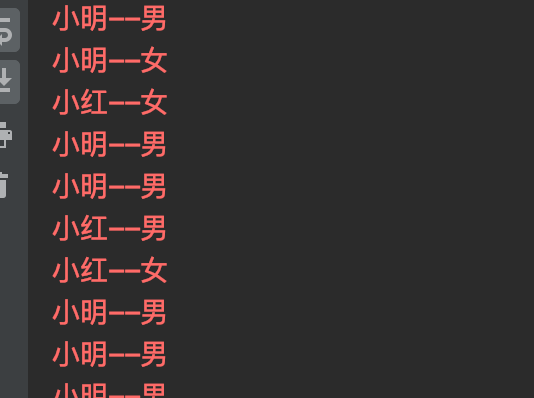
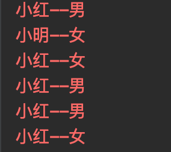
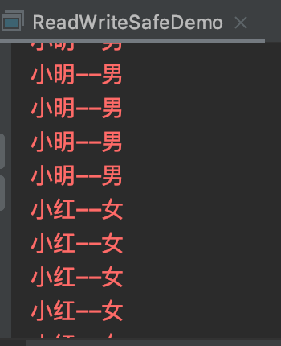
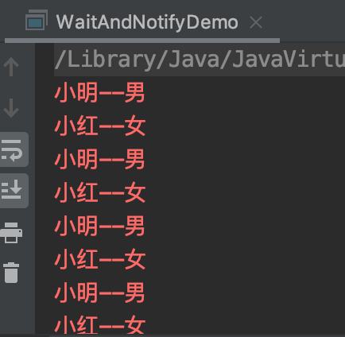

## 03. 多线程之间的通讯
1. 什么是多线程之间通讯？   
    就是多个线程在操作同一个资源，但是操作的动作不同（比如说一个线程负责读、一个线程负责写）
1. 案例：起2个线程，一个负责写（生产数据），另一个负责读（消费数据）(代码放置在readwritedemo包下)
    1. 原始实现：
        ```java
        public class OriginDemo {
            public static void main(String[] args) {
                DemoEntity demoEntity = new DemoEntity();
                Thread writeDemo = new Thread(new WriteThread01(demoEntity));
                Thread readDemo = new Thread(new ReadThread01(demoEntity));
                writeDemo.start();
                readDemo.start();
            }
        }
        
        class ReadThread01 implements Runnable{
        
            private DemoEntity demoEntity;
        
            public ReadThread01(DemoEntity demoEntity) {
                this.demoEntity = demoEntity;
            }
        
            @Override
            public void run() {
                while(true){
                    System.err.println(demoEntity.getName()+"--"+demoEntity.getGender());
                }
            }
        }
        
        class WriteThread01 implements Runnable{
        
            private DemoEntity demoEntity;
        
            private Integer count = 0;
        
            public WriteThread01(DemoEntity demoEntity) {
                this.demoEntity = demoEntity;
            }
        
            @Override
            public void run() {
                while(true){
                    if(count==0){
                        demoEntity.setName("小明");
                        demoEntity.setGender("男");
                    }else{
                        demoEntity.setName("小红");
                        demoEntity.setGender("女");
                    }
                    count= ++count % 2;
                }
            }
        }
        ```  
       可以看到，数据发生了混淆  
         
    1. 很明显，上面的方式线程不安全，通常是写不安全导致的，先给写操作加锁：  
        ``` java
        class WriteThread02 implements Runnable{
        
            private DemoEntity demoEntity;
        
            private Integer count = 0;
        
            public WriteThread02(DemoEntity demoEntity) {
                this.demoEntity = demoEntity;
            }
        
            @Override
            public void run() {
                while(true){
                    synchronized (demoEntity){
                        if(count==0){
                            demoEntity.setName("小明");
                            demoEntity.setGender("男");
                        }else{
                            demoEntity.setName("小红");
                            demoEntity.setGender("女");
                        }
                        count= ++count % 2;
                    }
                }
            }
        }
        ```  
        发现数据还是发生了混淆    
         
    1. 其实在这样的操作中，读与写都是要加锁的，而且要持有同一把锁。如果读操作不加锁，而写操作将数据改到一半（只改了个名字，性别还没改）
    就被读线程取走了数据，这样的数据就是无效的垃圾数据。
        ``` java
        class ReadThread03 implements Runnable{
        
            private DemoEntity demoEntity;
        
            public ReadThread03(DemoEntity demoEntity) {
                this.demoEntity = demoEntity;
            }
        
            @Override
            public void run() {
                while(true){
                    synchronized (demoEntity) {
                        System.err.println(demoEntity.getName()+"--"+demoEntity.getGender());
                    }
                }
            }
        }
        ```
        现在数据内容正常了，但输出了大量的重复数据，依旧不是我们想要的结果，我们想要的结果是，写线程每改（生产）一个，读线程就去读取（消费）一个  
         
    1. 理想的逻辑是这样的：程序开始时，读线程先停滞等待，写线程先生产一条数据，然后唤醒读线程去去读数据，之后写线程进入休眠状态。读线程被唤醒，
    读取数据后，唤醒写线程之后读线程进入休眠状态……循环往复，达到写一条读一条……的效果
1. wait()与notify()
    1. wait()：暂定当前正在执行的线程,并释放资源锁
    1. notify()：唤醒因锁池中的线程并运行
    1. wait()与notify()一定要在线程同步(synchronized)中使用,并且是同一个锁的资源
    1. wait()与sleep()的区别：
        1. sleep()Thread类中的。而wait()方法，则是属于Object对象的。
    1. 使用了wait()与notify()之后的案例：
        ``` java
        class ReadThread04 implements Runnable{
        
            private DemoEntity demoEntity;
        
            public ReadThread04(DemoEntity demoEntity) {
                this.demoEntity = demoEntity;
            }
        
            @Override
            public void run() {
                while(true){
                    synchronized (demoEntity) {
                        if(!demoEntity.getFlag()){
                            try {
                                demoEntity.wait();
                            } catch (InterruptedException e) {
                                e.printStackTrace();
                            }
                        }
                        System.err.println(demoEntity.getName()+"--"+demoEntity.getGender());
                        demoEntity.setFlag(false);
                        demoEntity.notify();
                    }
                }
            }
        }
        
        class WriteThread04 implements Runnable{
        
            private DemoEntity demoEntity;
        
            private Integer count = 0;
        
            public WriteThread04(DemoEntity demoEntity) {
                this.demoEntity = demoEntity;
            }
        
            @Override
            public void run() {
                while(true){
                    synchronized (demoEntity){
                        if(demoEntity.getFlag()){
                            try {
                                demoEntity.wait();
                            } catch (InterruptedException e) {
                                e.printStackTrace();
                            }
                        }
                        if(count==0){
                            demoEntity.setName("小明");
                            demoEntity.setGender("男");
                        }else{
                            demoEntity.setName("小红");
                            demoEntity.setGender("女");
                        }
                        count= ++count % 2;
                        demoEntity.setFlag(true);
                        demoEntity.notify();
                    }
                }
            }
        }
        ```
        可以发现，现在的数据达到预期  
         
1. Lock锁简单使用（相关代码放置在lock包下）
    1. Lock 接口提供了与 synchronized 关键字类似的同步功能，但需要在使用时手动获取锁和释放锁。
    1. 模板写法：
        ``` java
        Lock lock  = new ReentrantLock();
        lock.lock();
        try{
            //可能会出现线程安全的操作
        }finally{
            //一定在finally中释放锁
            //也不能把获取锁在try中进行，因为有可能在获取锁的时候抛出异常
          lock.ublock();
        }
        ```
    1. Condition类的功能类似于在传统的线程技术中的,Object.wait()和Object.notify()的功能。
    1. 示例写法：  
        ``` java
        Condition condition = lock.newCondition();
        condition.await();  // 类似wait
        condition.signal()  // 类似notify 
        ```
    1. 使用Lock接口与Condition类重新实现上面的案例  
        ``` java
        public class LockDemo{
            public static void main(String[] args) {
                // 同一个实体
                LockDemoEntity demoEntity = new LockDemoEntity();
                // 同一个condition对象
                Condition condition = demoEntity.getLock().newCondition();
                Thread writeDemo = new Thread(new WriteThread05(demoEntity,condition));
                Thread readDemo = new Thread(new ReadThread05(demoEntity,condition));
                writeDemo.start();
                readDemo.start();
            }
        }
        
        class ReadThread05 implements Runnable{
        
            private LockDemoEntity demoEntity;
        
            private Condition condition;
        
            public ReadThread05(LockDemoEntity demoEntity, Condition condition) {
                this.demoEntity = demoEntity;
                this.condition = condition;
            }
        
            @Override
            public void run() {
                while(true){
                    try {
                        demoEntity.getLock().lock();
                        if(!demoEntity.getFlag()){
                            try {
        //                        demoEntity.wait();
                                condition.await();
                            } catch (InterruptedException e) {
                                e.printStackTrace();
                            }
                        }
                        System.err.println(demoEntity.getName()+"--"+demoEntity.getGender());
                        demoEntity.setFlag(false);
                        // demoEntity.notify();
                        condition.signal();
                    } catch (Exception e) {
                        e.printStackTrace();
                    }finally {
                        demoEntity.getLock().unlock();
                    }
                }
            }
        }
        
        class WriteThread05 implements Runnable{
        
            private LockDemoEntity demoEntity;
        
            private Condition condition;
        
            private Integer count = 0;
        
            public WriteThread05(LockDemoEntity demoEntity, Condition condition) {
                this.demoEntity = demoEntity;
                this.condition = condition;
            }
        
            @Override
            public void run() {
                while(true){
                    try {
                        demoEntity.getLock().lock();
                        if(demoEntity.getFlag()){
                            try {
            //                        demoEntity.wait();
                                condition.await();
                            } catch (InterruptedException e) {
                                e.printStackTrace();
                            }
                        }
                        if(count==0){
                            demoEntity.setName("小明");
                            demoEntity.setGender("男");
                        }else{
                            demoEntity.setName("小红");
                            demoEntity.setGender("女");
                        }
                        count= ++count % 2;
                        demoEntity.setFlag(true);
        //                demoEntity.notify();
                        condition.signal();
                    } catch (Exception e) {
                        e.printStackTrace();
                    }finally {
                        demoEntity.getLock().unlock();
                    }
                }
            }
        }
        ```
        从数据上看，效果与之前无异  
         

>[Java多线程学习（六）Lock锁的使用](https://juejin.im/post/5ab9a5b46fb9a028ce7b9b7e)