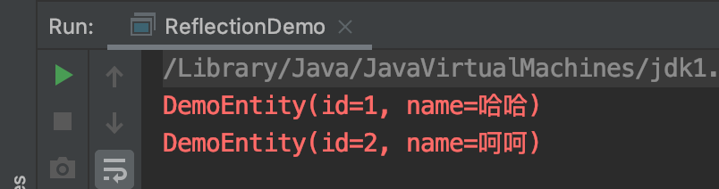
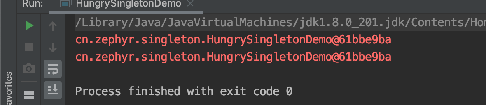
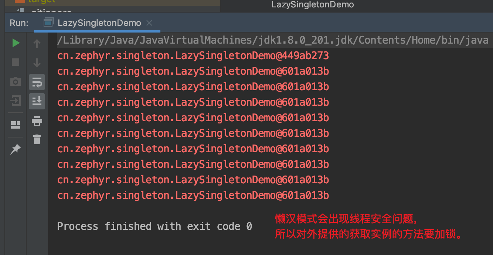
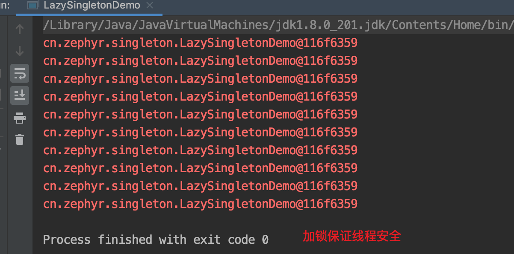
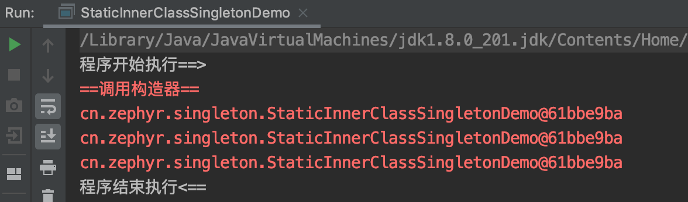
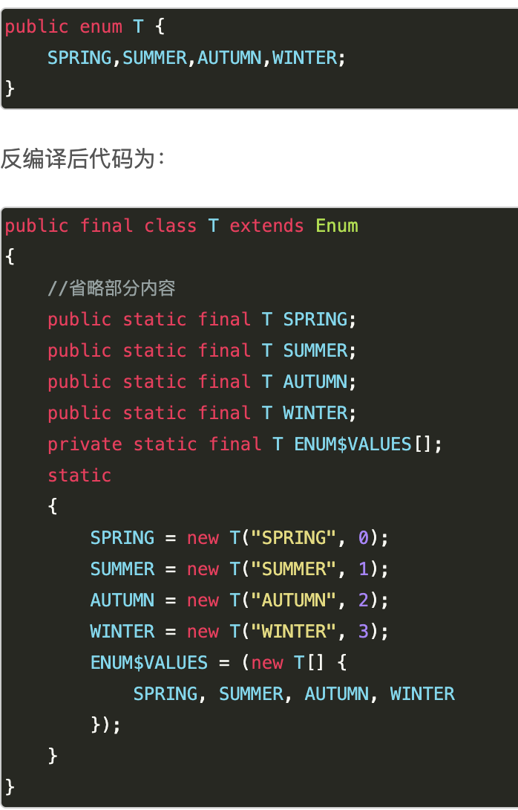
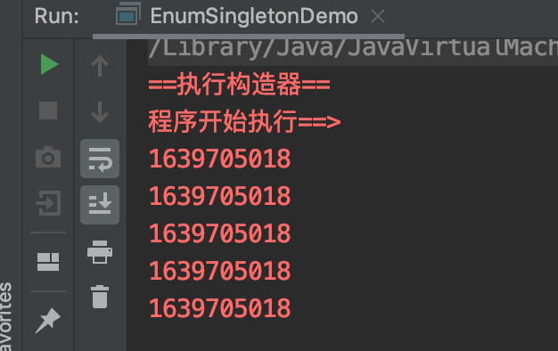
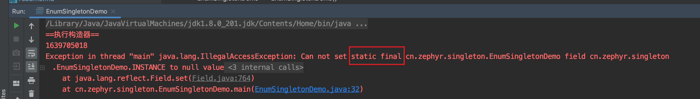
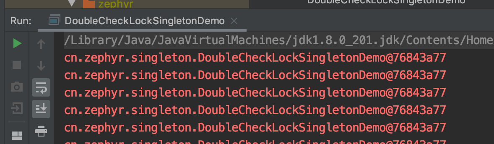
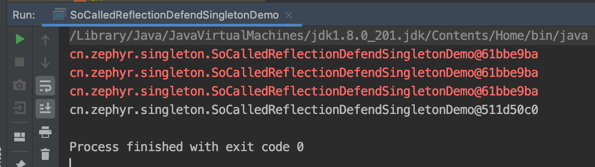

## 07. Java反射基本使用与单例模式
### 1. 反射机制
Java 反射机制在程序运行时，对于任意一个类，都能够知道这个类的所有属性和方法。通过反射，我们可以将class文件反编译为java文件，也能通过反射机制访问java对象的属性，方法，构造方法等；  

反射机制获取类的三种方法：
1. 使用Class.forName：```Class clazz = Class.forName("packageName.className");```
1. 直接使用类：```Class clazz = Xxx.class;```
1. 根据对象获取类：```Class clazz = obj.getClass();```  

反射创建对象的方式：
1. 直接使用默认无参构造器方式创建（不提供默认构造器则会报错）
1. 指定某个有参构造器方式创建  
上述2种方式的代码示例：  
```java
public class ReflectionDemo {
    public static void main(String[] args) throws Exception {
        Class<DemoEntity> clazz = (Class<DemoEntity>) Class.forName("cn.zephyr.reflection.DemoEntity");
        System.err.println(getInstance01(clazz));
        System.err.println(getInstance02(clazz));
    }

    private static DemoEntity getInstance01(Class<DemoEntity> clazz) throws Exception {
        // 使用无参构造器
        DemoEntity demoEntity = clazz.newInstance();
        demoEntity.setId(1);
        demoEntity.setName("哈哈");
        return demoEntity;
    }
    private static DemoEntity getInstance02(Class<DemoEntity> clazz) throws Exception {
        // 指定（有参）构造器
        Constructor<DemoEntity> constructor = clazz.getDeclaredConstructor(Integer.class, String.class);
        return constructor.newInstance(2, "呵呵");
    }
}
```  


常用的反射方法：  
| 方法名称 | 作用 |
| :---- | :---- |
| getDeclaredMethods []	| 获取该类的所有方法 |
| getReturnType() |	获取该类的返回值 |
| getParameterTypes() |	获取传入参数 |
| getDeclaredFields() |	获取该类的所有字段 |
| setAccessible |	允许访问私有成员 |

使用反射方式操作私有属性：  
``` declaredField.setAccessible(true); ```
### 2. 单例模式
5（+1）种单例创建模式（1.饿汉式、2.懒汉式、3.静态内部类方式、4.枚举方式 __【墙裂推荐】__、5.双重锁检测式、（附加：网传所谓防反射方式，其实无法抵御））：
1. 饿汉式(优点：线程安全；缺点：无法抵御反射攻击，可能有资源占用（不管是否只用都会初始化实例）)：  
   ```java
   public class HungrySingletonDemo {
       private static HungrySingletonDemo singleTonDemo = new HungrySingletonDemo();
   
       public static HungrySingletonDemo getInstance(){
           return singleTonDemo;
       }
   
       private HungrySingletonDemo() {
       }
   
       public static void main(String[] args) {
           System.err.println(HungrySingletonDemo.getInstance());
           System.err.println(HungrySingletonDemo.getInstance());
       }
   }
   ```    
    
1. 懒汉式（优点：用到时才会创建（减少资源占用）；缺点：有线程安全问题（需要加锁），无法抵御反射攻击）
    ```java
    public class LazySingletonDemo {
        private static LazySingletonDemo lazySingletonDemo;
    
        private LazySingletonDemo() {
        }
        // 加锁
        public static synchronized LazySingletonDemo newInstance(){
            if(lazySingletonDemo == null)
                lazySingletonDemo = new LazySingletonDemo();
            return lazySingletonDemo;
        }
    
        public static void main(String[] args) {
            for (int i = 0; i < 10; i++) {
                new Thread(new Runnable() {
                    @Override
                    public void run() {
                        try {
                            Thread.sleep(10);
                        } catch (InterruptedException e) {
                            e.printStackTrace();
                        }
                        System.err.println(LazySingletonDemo.newInstance());
                    }
                }).start();
            }
        }
    }
    ```  
      
      
1. 静态内部类方式（优点：线程安全、减少资源占用（内部类懒加载机制）；缺点：无法抵御反射攻击）
    ```java
    public class StaticInnerClassSingletonDemo {
    
        private static class MyInnerClass{
            private static StaticInnerClassSingletonDemo singletonDemo = new StaticInnerClassSingletonDemo();
        }
    
        private StaticInnerClassSingletonDemo() {
            System.err.println("==调用构造器==");
        }
    
        public static StaticInnerClassSingletonDemo getInstance(){
            return MyInnerClass.singletonDemo;
        }
    
        public static void main(String[] args) throws InterruptedException {
            System.out.println("程序开始执行==>");
            Thread.sleep(100);
            System.err.println(StaticInnerClassSingletonDemo.getInstance());
            System.err.println(StaticInnerClassSingletonDemo.getInstance());
            System.err.println(StaticInnerClassSingletonDemo.getInstance());
            System.out.println("程序结束执行<==");
        }
    }
    ```  
    
1. 枚举方式（墙裂推荐！优点：线程安全、防反射；缺点：（可能）额外资源占用）
(枚举在经过javac的编译之后，会被转换成形如```public final class T extends Enum```的定义，枚举值都是static final类型的，并且在静态代码块中初始化。)，这些特性都是天生的，JVM给的）  
      
    ```java
    public enum  EnumSingletonDemo {
        INSTANCE;
    
        private String name;
        private Integer age;
    
        EnumSingletonDemo() {
            System.err.println("==执行构造器==");
        }
    
        public static void main(String[] args) throws InterruptedException {
            System.err.println("程序开始执行==>");
            Thread.sleep(100);
            for (int i = 0; i < 5; i++) {
                System.err.println(EnumSingletonDemo.INSTANCE.hashCode());
            }
        }
    }
    ```
      
    尝试反射攻击：  
    ``` java
    public static void main(String[] args) throws Exception {
            EnumSingletonDemo instance = EnumSingletonDemo.INSTANCE;
            System.err.println(instance.hashCode());
            Field field = EnumSingletonDemo.class.getDeclaredField("INSTANCE");
            field.setAccessible(true);
            field.set(instance,null);
            System.err.println(EnumSingletonDemo.INSTANCE);
    }
    ```  
      
1. 双重锁检测方式（优点：线程安全，缺点：无法抵御反射攻击、写法复杂、性能一般（使用了关键字禁止重排序））： 
    new（创建对象）的过程并不是原子的，而是分为3步（2、3步之间，可能会被重排序，造成创建对象顺序变为1-3-2）：    
    1. 分配对象的内存空间
    1. 初始化对象
    1. 设置instance指向刚分配的内存地址   
    所以需要额外添加volatile关键字禁止重排序。 
        
    ```java
    public class DoubleCheckLockSingletonDemo {
        // volatile关键字禁止重排序
        private static volatile DoubleCheckLockSingletonDemo singletonDemo;
    
        public static DoubleCheckLockSingletonDemo getInstance() throws InterruptedException {
            Thread.sleep(100);
            if(singletonDemo == null){
                synchronized (DoubleCheckLockSingletonDemo.class){
                    if(singletonDemo == null){
                        // new的过程不是原子的，可能受到重排序影响
                        singletonDemo = new DoubleCheckLockSingletonDemo();
                    }
                }
            }
            return singletonDemo;
        }
    
        public static void main(String[] args) {
            for (int i = 0; i < 10; i++) {
                new Thread(new Runnable() {
                    @Override
                    public void run() {
                        try {
                            System.err.println(DoubleCheckLockSingletonDemo.getInstance());
                        } catch (InterruptedException e) {
                            e.printStackTrace();
                        }
                    }
                }).start();
            }
        }
    }
    ```   
      
1. 附加：网传所谓防反射机制的单例
    ```java
    public class SoCalledReflectionDefendSingletonDemo {
        private static Boolean flag = false;
    
        private static SoCalledReflectionDefendSingletonDemo singletonDemo;
    
        private SoCalledReflectionDefendSingletonDemo() {
            if(flag){
                throw new RuntimeException("Reflection Defend!");
            }
        }
    
        public static synchronized SoCalledReflectionDefendSingletonDemo getInstance(){
            if(null == singletonDemo){
                singletonDemo = new SoCalledReflectionDefendSingletonDemo();
                flag = true;
            }
            return singletonDemo;
        }
    }
    ```  
   尝试反射攻击：
   ``` java
    public static void main(String[] args) throws Exception {
        SoCalledReflectionDefendSingletonDemo instance = SoCalledReflectionDefendSingletonDemo.getInstance();
        System.err.println(instance);
        System.err.println(SoCalledReflectionDefendSingletonDemo.getInstance());
        System.err.println(SoCalledReflectionDefendSingletonDemo.getInstance());
        // 反射攻击开始==>
        Field flag = SoCalledReflectionDefendSingletonDemo.class.getDeclaredField("flag");
        flag.setAccessible(true);
        flag.set(instance,false);
        Field singletonDemo = SoCalledReflectionDefendSingletonDemo.class.getDeclaredField("singletonDemo");
        singletonDemo.set(instance,null);
        // 反射攻击结束<==
        System.out.println(SoCalledReflectionDefendSingletonDemo.getInstance());
    }
   ```    
      
    
如何防止反射攻击： 使用枚举方式创建单例   
如何选择单例创建方式：  
1. 如果不需要延迟加载单例，可以使用枚举或者饿汉式，相对来说枚举性好于饿汉式。  
1. 如果需要延迟加载，可以使用静态内部类或者懒汉式，相对来说静态内部类好于懒汉式。  

>[【Java】线程安全的单例模式----静态内部类](https://www.jianshu.com/p/ff9315716930)  
>[Java枚举enum以及应用：枚举实现单例模式](https://www.cnblogs.com/cielosun/p/6596475.html)  
>[为什么我墙裂建议大家使用枚举来实现单例](https://www.hollischuang.com/archives/2498)  