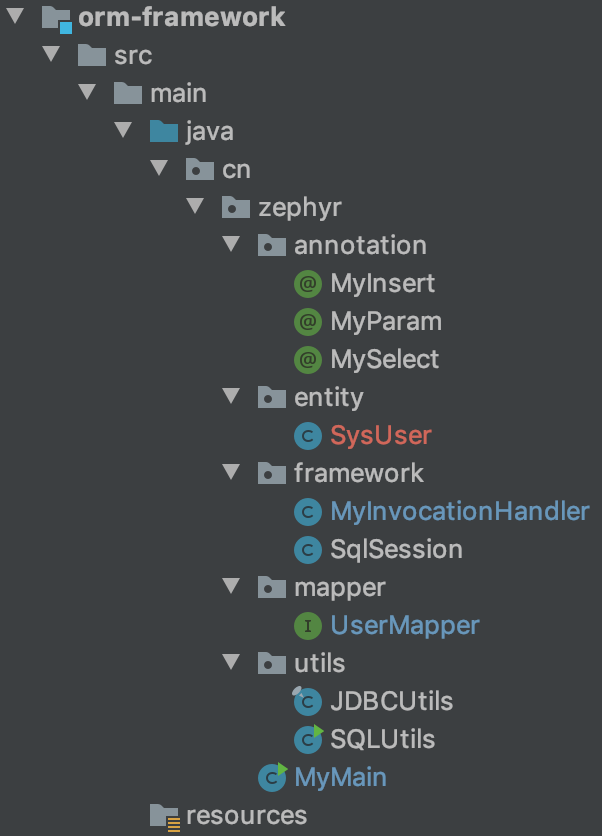

## 20. 手写基于注解的简易ORM框架
### 01. 基于JDK Proxy的动态代理(dynamic proxy)与面向切面编程(Aspect Oriented Programming,AOP)
#### 动态代理(以JDK Proxy为例)
  在代码运行时创建动态代理对象，代理对象 __通常__ 会持有被代理对象，业务代码实际持有的是动态代理对象(与被代理对象实现(继承)同一个父类(接口))。代理类中会要求实现InvocationHandler的
invoke()方法，而在这个方法中，通常会调用被代理对象的method.invoke()方法(正在的业务逻辑)，而在此之前或之后，我们就可以实现一些业务无关的功能（日志打印、性能记录等）。  
#### 面向切面编程（非Spring AOP）
在这里讲解一种简单可行的方案：在动态代理中，把接口作为代理对象，可以在invoke方法中主动实现对应的方法（组装来自方法注解、配置文件的业务），实现面向接口编程。
#### 代码示例： 
```java
public class MyInvocationHandler implements InvocationHandler {

//    private Object target;

    /*public MyInvocationHandler(Object target) {
        this.target = target;
    }*/

    @Override
    public Object invoke(Object proxy, Method method, Object[] args) throws Throwable {
        System.err.println("==动态代理---方法拦截==");
        return 1;
    }
}
```
```java
public interface UserMapper {
    int insertSelective();
}
```
```java
public class MyProxyMain {

    public static void main(String[] args) {
        UserMapper userMapper = (UserMapper) Proxy.newProxyInstance(
                UserMapper.class.getClassLoader(),
                new Class[]{UserMapper.class},
                new MyInvocationHandler()
        );
        int i = userMapper.insertSelective();
        System.err.println("sql返回结果："+i);
    }

}
```
控制台输出：
```text
==动态代理---方法拦截==
sql返回结果：1
```
### 02. 实现基于注解的简易ORM框架
#### 思路：  
Mapper接口的方法上使用自定义注解，sql语句写在注解上。使用动态代理对mapper接口实现代理，由代理对象来执行注解上的sql语句并返回执行结果
#### 代码实现
1. 整体目录结构：
      
1. 三个自定义注解
    ```java
    @Documented
    @Retention(RetentionPolicy.RUNTIME)
    @Target(ElementType.METHOD)
    public @interface MySelect {
        String value();
    }
    ```
    ```java
    @Documented
    @Retention(RetentionPolicy.RUNTIME)
    @Target(ElementType.METHOD)
    public @interface MyInsert {
        String value();
    }
    ```
    ```java
    @Documented
    @Retention(RetentionPolicy.RUNTIME)
    @Target(ElementType.PARAMETER)
    public @interface MyParam {
        String value();
    }
    ```
1. 2个工具类（JDBCUtils、SQLUtils，代码略）
1. SqlSesssion：
    ```java
    public class SqlSession {
    
        public static <T> T getMapper(Class<T> clazz){
            return (T)Proxy.newProxyInstance(clazz.getClassLoader(),new Class[]{clazz},new MyInvocationHandler());
        }
    }
    ```
1. UserMapper:
    ```java
    public interface UserMapper {
        @MyInsert("insert into sys_user(username,age) values(#{userName},#{age})")
        int insertUser(@MyParam("userName")String userName, @MyParam("age")Integer age);
    
        @MySelect("select * from sys_user where id = #{id}")
        SysUser queryByPrimaryKey(@MyParam("id") Integer id);
    }
    ```
1. MyInvocationHandler:
    ```java
    public class MyInvocationHandler implements InvocationHandler {
    
        @Override
        public Object invoke(Object proxy, Method method, Object[] args) throws Throwable {
            MySelect mySelect = method.getDeclaredAnnotation(MySelect.class);
            if(null != mySelect){
                return executeSelect(method, args, mySelect);
            }
            MyInsert myInsert = method.getDeclaredAnnotation(MyInsert.class);
            if(null != myInsert){
                return executeInsert(method, args, myInsert);
            }
            return null;
        }
    
        private Object executeSelect(Method method, Object[] args, MySelect mySelect) throws SQLException, InstantiationException, IllegalAccessException {
            System.err.println("===execute sql select===");
            // 存放入参键、值
            Map<String,Object> paramMap = new HashMap<>();
            // 获取注解上的原始sql
            String selectSql = mySelect.value();
            // 获取注解上原始sql的参数(包裹在'#{'、'}'之间)
            List<String> selectParameterList = SQLUtils.sqlSelectParameter(selectSql);
            // 获取方法入参名称
            Parameter[] parameters = method.getParameters();
            if(parameters.length>0){
                for (int i = 0; i < parameters.length; i++) {
                    Parameter param = parameters[i];
                    MyParam myParam = param.getDeclaredAnnotation(MyParam.class);
                    String paramName = myParam.value();
                    paramMap.put(paramName, args[i]);
                }
            }
            // 顺序组装jdbc sql语句的参数
            List<Object> paramObjList = new ArrayList<>();
            for (String selectParam : selectParameterList) {
                Object paramObj = paramMap.get(selectParam.trim());
                if(null == paramObj)
                    throw new RuntimeException(selectParam+"参数不存在");
                paramObjList.add(paramObj);
            }
    
            selectSql = SQLUtils.parameQuestion(selectSql, selectParameterList);
            ResultSet rs = JDBCUtils.query(selectSql, paramObjList);
            if(!rs.next()){
                return null;
            }
            rs.previous();
            Class<?> returnType = method.getReturnType();
            Object newInstance = returnType.newInstance();
            while(rs.next()){
                Field[] fields = returnType.getDeclaredFields();
                for (Field field : fields) {
                    field.setAccessible(true);
                    field.set(newInstance,rs.getObject(field.getName()));
                }
            }
            return newInstance;
        }
    
        private Object executeInsert(Method method, Object[] args, MyInsert myInsert) {
            System.err.println("===execute sql insert===");
            // 存放入参键、值
            Map<String,Object> paramMap = new HashMap<>();
            // 获取注解上的原始sql
            String insertSql = myInsert.value();
            // 获取注解上原始sql的参数(包裹在'#{'、'}'之间)
            String[] insertParameters = SQLUtils.sqlInsertParameter(insertSql);
            // 获取方法入参名称
            Parameter[] parameters = method.getParameters();
            if(parameters.length>0){
                for (int i = 0; i < parameters.length; i++) {
                    Parameter param = parameters[i];
                    MyParam myParam = param.getDeclaredAnnotation(MyParam.class);
                    String paramName = myParam.value();
                    paramMap.put(paramName, args[i]);
                }
            }
            // 顺序组装jdbc sql语句的参数
            List<Object> paramObjList = new ArrayList<>();
            for (String insertParameter : insertParameters) {
                Object paramObj = paramMap.get(insertParameter.trim());
                if(null == paramObj)
                    throw new RuntimeException(insertParameter+"参数不存在");
                paramObjList.add(paramObj);
            }
            insertSql = SQLUtils.parameQuestion(insertSql, insertParameters);
            return JDBCUtils.insert(insertSql,true,paramObjList);
        }
    }
    ```
1. MyMain:
    ```java
    public class MyMain {
    
        public static void main(String[] args) {
            UserMapper userMapper = SqlSession.getMapper(UserMapper.class);
            userMapper.insertUser("haha",25);
            SysUser sysUser = userMapper.queryByPrimaryKey(4);
            System.err.println(sysUser.toString());
        }
    }   
    ```
1. 执行效果；
    ```text
    ===execute sql insert===
    insert自增id：11
    ===execute sql select===
    SysUser(id=4, userName=haha, age=19)
    ```