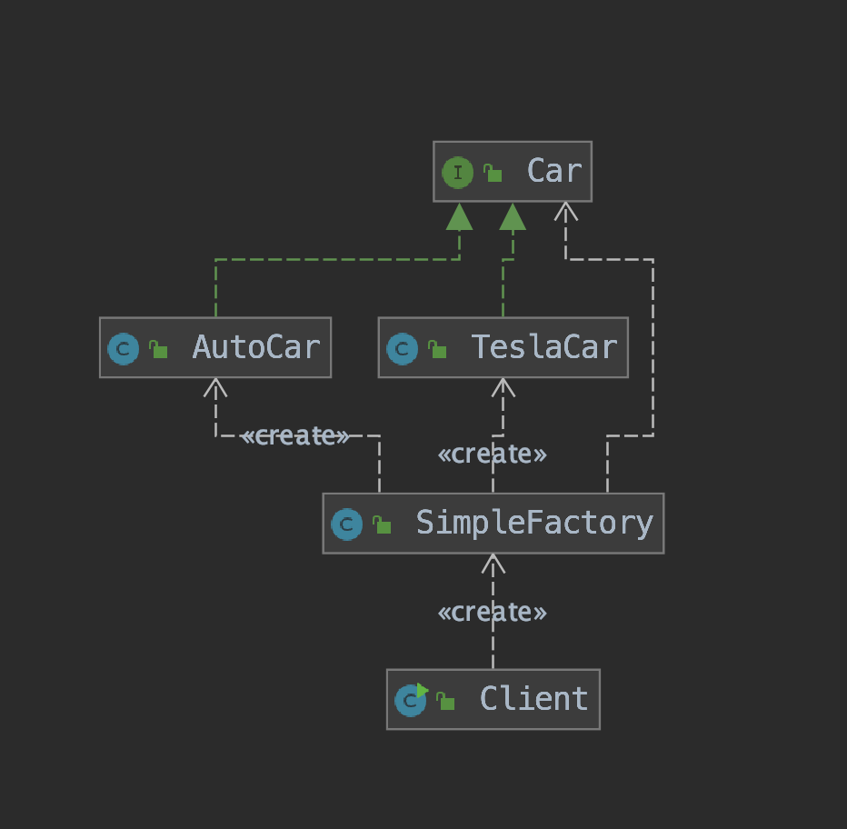
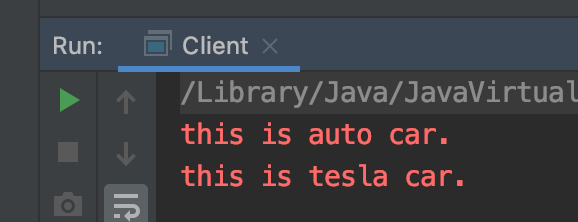
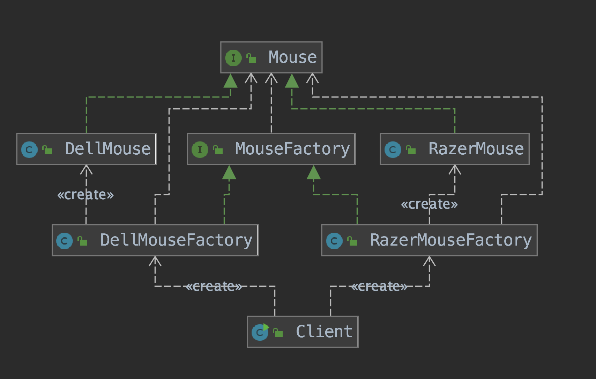
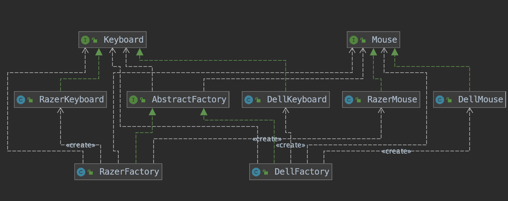

## 08. 工厂模式与代理模式
### 一、 工厂模式
#### 1. 工厂模式的定义   
“Define an interface for creating an object, but let subclasses decide which class to instantiate. 
Factory Method lets a class defer instantiation to subclasses.”
(在基类中定义创建对象的一个接口，让子类决定实例化哪个类。工厂方法让一个类的实例化延迟到子类中进行。)
#### 2. 工厂模式的分类
1. 简单工厂模式  
    1. 概述：简单工厂模式相当于是一个工厂中有各种产品，创建在一个类中，客户无需知道具体产品的名称，只需要知道产品类所对应的参数即可。
    但是工厂的职责过重，而且当类型过多时不利于系统的扩展维护。
    1. 角色分配：
        1. 工厂角色：简单工厂模式的核心，它负责实现创建所有实例的内部逻辑。工厂类可以被外界直接调用，创建所需的产品对象。
        1. 抽象产品角色：简单工厂模式所创建的所有对象的父类，它负责描述所有实例所共有的公共接口。
        1. 具体产品角色：简单工厂模式的创建目标，所有创建的对象都是充当这个角色的某个具体类的实例。
    1. 案例：汽车制造工厂
        1. 抽象Car接口类（抽象产品角色）
            ```java
            public interface Car {
                void run();
            }
            ```
        1. 2种具体的车（具体产品角色）
            ```java
            public class AutoCar implements Car {
                @Override
                public void run() {
                    System.err.println("this is auto car.");
                }
            }
            ```
           ```java
            public class TeslaCar implements Car {
                @Override
                public void run() {
                    System.err.println("this is tesla car.");
                }
            }
            ```
        1. 汽车制造工厂（工厂角色）
            ```java
            public class SimpleFactory {
                public Car produceCar(String carBrand){
                    if(carBrand.equals("auto"))
                        return new AutoCar();
                    else if(carBrand.equals("tesla")){
                        return new TeslaCar();
                    }
                    else
                        return null;
                }
            }
            ```
        1. 客户（实际使用者）
            ```java
            public class Client {
                public static void main(String[] args) {
                    new SimpleFactory().produceCar("auto").run();
                    new SimpleFactory().produceCar("tesla").run();
                }
            }
            ```  
        1. 类图总览：  
            
        1. 效果：  
              
    1. 优点：1. 简单；2. 客户端不关心对象的创建过程
    1. 缺点：1. 由于过于简单，适用的场景较少；2.如果我们新增产品类的话，就需要修改工厂类中的produceCar()方法，这很明显不符合 __开放-封闭原则__ 。
1. 工厂方法模式
    1. 概述：  
    在工厂方法模式中，我们不再提供一个统一的工厂类来创建所有的对象，而是针对不同的对象提供不同的工厂。
    也就是说 __每个对象都有一个与之对应的工厂__（客户需要哪个产品，就手动指定某个具体的工厂生产，而不是像简单工厂模式那种，所有的产品都由同一个巨无霸工厂统一生产） 。
    1. 角色分配：
        1. 抽象工厂角色：是工厂方法模式的核心，与应用程序无关。任何创建相关产品对象的工厂类必须实现这个接口。
        1. 具体工厂角色：这是实现抽象工厂接口的具体工厂类，包含与应用程序密切相关的逻辑，并且受到应用程序调用以创建某一种具体的产品对象。
        1. 抽象产品角色：产品对象的抽象定义，具体的产品都将实现这个接口
        1. 具体产品角色：某具体产品有专门的具体工厂创建，具体工厂与具体产品之间往往一一对应；
    1. 案例：鼠标制造工厂
        1. 抽象鼠标（抽象产品角色）
            ```java
            public interface Mouse {
                void use();
            }
            ```
        1. 2种具体鼠标（具体产品角色）
            ```java
            public class DellMouse implements Mouse {
                @Override
                public void use() {
                    System.err.println("this is dell mouse");
                }
            }
            ```
            ```java
            public class RazerMouse implements Mouse {
                @Override
                public void use() {
                    System.err.println("this is razer mouse.");
                }
            }
            ``` 
        1. 抽象鼠标工厂（抽象工厂角色）
            ```java
            public interface MouseFactory {
                Mouse produce();
            }
            ```
        1. 2种具体的鼠标工厂（具体工厂角色）
            ```java
            public class DellMouseFactory implements MouseFactory {
                @Override
                public Mouse produce() {
                    return new DellMouse();
                }
            }
            ```
            ```java
            public class RazerMouseFactory  implements MouseFactory {
            
                @Override
                public Mouse produce() {
                    return new RazerMouse();
                }
            }
            ``` 
        1. 类图总览：  
            
        1. 控制台输出：  
            ```text
            this is razer mouse.
            this is dell mouse
            ```
    1. 优点：
        1. 将创建对象的任务委托给多个工厂子类中的某一个，客户端在使用时可以无需关心是哪一个工厂子类创建产品子类，需要时再动态指定，可将具体工厂类的类名存储在配置文件或数据库中；
        1. 一个类通过其子类来指定创建哪个对象：对于抽象工厂类只需要提供一个创建抽象产品的接口，而由其子类来确定具体要创建的产品对象；
        1. 客户端不需要知道具体产品类的类名，只需要知道所对应的工厂即可，具体的产品对象由具体工厂类创建，但客户端需要知道创建具体产品的工厂类。
    1. 缺点（相比抽象工厂模式）：只能创建单一的产品线（这个问题交给抽象工厂模式解决）
1. 抽象工厂模式
    1. 引入：在工厂方法模式中具体工厂负责生产具体的产品，每一个具体工厂对应一种具体产品，工厂方法也具有唯一性，一般情况下，一个具体工厂中只有一个工厂方法或者一组重载的工厂方法。
    但是有时候我们需要一个工厂可以提供多个产品对象，而不是单一的产品对象。 
    1. 概述：
        1. 抽象工厂模式是工厂方法的进一步深化，在这个模式中的工厂类不单单可以创建一种产品，而是可以创建一组产品。
        1. 为了更清晰地理解工厂方法模式，需要先引入两个概念：
            1. 产品等级结构 ：产品等级结构即产品的继承结构，如一个抽象类是电视机，其子类有海尔电视机、海信电视机、TCL电视机，
            则抽象电视机与具体品牌的电视机之间构成了一个产品等级结构，抽象电视机是父类，而具体品牌的电视机是其子类。
            1. 产品族 ：在抽象工厂模式中，产品族是指由同一个工厂生产的，位于不同产品等级结构中的一组产品，如海尔电器工厂生产的海尔电视机、海尔电冰箱，
            海尔电视机位于电视机产品等级结构中，海尔电冰箱位于电冰箱产品等级结构中。
        1. 当系统所提供的工厂所需生产的具体产品并不是一个简单的对象，而是多个位于不同产品等级结构中属于不同类型的具体产品时需要使用抽象工厂模式。
    1. 角色分配：
        1. 抽象工厂角色
        1. 具体工厂角色
        1. 抽象产品角色
        1. 具体产品角色
    1. 案例：鼠标、键盘制造工厂
        1. 抽象鼠标键盘制造工厂（抽象工厂角色）
        ```java
        public interface AbstractFactory {
            Mouse produceMouse();
        
            Keyboard produceKeyboard();
        }
        ```
        1. 2种具体的鼠标键盘制造工厂（具体工厂角色）
        ```java
        public class DellFactory implements AbstractFactory {
            @Override
            public Mouse produceMouse() {
                return new DellMouse();
            }
        
            @Override
            public Keyboard produceKeyboard() {
                return new DellKeyboard();
            }
        }
        ```
        ```java
        public class RazerFactory implements AbstractFactory {
            @Override
            public Mouse produceMouse() {
                return new RazerMouse();
            }
        
            @Override
            public Keyboard produceKeyboard() {
                return new RazerKeyboard();
            }
        }
        ```
        1. 抽象的鼠标、抽象的键盘（抽象产品角色）
        ```java
        public interface Mouse {
            void use();
        }
        ```
        ```java
        public interface Keyboard {
            void use();
        }
        ```
        1. 具体的鼠标、具体的键盘（具体产品角色）
        ```java
        public class DellKeyboard implements Keyboard {
            @Override
            public void use() {
                System.out.println("this is dell keyboard.");
            }
        }
        ```
        ```java
        public class DellMouse implements Mouse {
            @Override
            public void use() {
                System.out.println("this is dell mouse.");
            }
        }
        ```
        ```java
        public class RazerKeyboard implements Keyboard {
            @Override
            public void use() {
                System.err.println("this is raser keyboard.");
            }
        }
        ```
        ```java
        public class RazerMouse implements Mouse {
            @Override
            public void use() {
                System.err.println("this is razer mouse");
            }
        }
        ```
        1. 客户： 
        ```java
        public class AbstractFactoryClient {
            public static void main(String[] args) {
                // Razer
                AbstractFactory factory = new RazerFactory();
                factory.produceMouse().use();
                factory.produceKeyboard().use();
                // Dell
                factory = new DellFactory();
                factory.produceMouse().use();
                factory.produceKeyboard().use();
            }
        }
        ```
        1. 类图总览： 
            
        1. 输出：  
            ``` text
            this is razer mouse
            this is raser keyboard.
            this is dell mouse.
            this is dell keyboard.
           ```
    1. 优点：
        1. 抽象工厂模式比工厂方法模式更为简单、有效率。
        1. 增加新的具体工厂和对应的产品族很方便，无须修改已有系统，符合“开闭原则”。
    1. 缺点：在添加新的产品对象时，难以扩展抽象工厂来生产新种类的产品，这是因为在抽象工厂角色中规定了所有可能被创建的产品集合，
        要支持新种类的产品就意味着要对该接口进行扩展，而这将涉及到对抽象工厂角色及其所有子类的修改，显然会带来较大的不便。
    1. 抽象工厂模式的退化：当抽象工厂模式中每一个具体工厂类只创建一个产品对象，也就是只存在一个产品等级结构时，抽象工厂模式退化成工厂方法模式；
    当工厂方法模式中抽象工厂与具体工厂合并，提供一个统一的工厂来创建产品对象，并将创建对象的工厂方法设计为静态方法时，工厂方法模式退化成简单工厂模式。
          
### 1. 代理模式
1. 静态代理
1. 动态代理
    1. 基于JDK的动态代理
    1. 基于CGLIB的动态代理

>[深入理解工厂模式](https://segmentfault.com/a/1190000015050674)  
>[me115/design_patterns](https://github.com/me115/design_patterns/tree/master/creational_patterns)  
>[轻松学，Java 中的代理模式及动态代理](https://blog.csdn.net/briblue/article/details/73928350)  