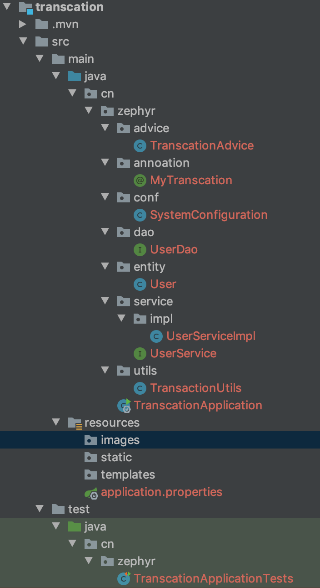

## 16. 手动实现基于自定义注解的事务管理

### 一、Spring中事务管理的基本使用（基于```@Transactional```）
#### 01.环境搭建（SpringBoot + Jpa）
pom.xml:  
```xml
   <parent>
        <groupId>org.springframework.boot</groupId>
        <artifactId>spring-boot-starter-parent</artifactId>
        <version>1.5.8.RELEASE</version>
    </parent>

    <groupId>cn.zephyr</groupId>
    <artifactId>zephyr-arch</artifactId>
    <packaging>pom</packaging>
    <version>1.0-SNAPSHOT</version>

    <dependencies>
        <dependency>
            <groupId>org.springframework.boot</groupId>
            <artifactId>spring-boot-starter-web</artifactId>
        </dependency>

        <dependency>
            <groupId>org.springframework.boot</groupId>
            <artifactId>spring-boot-starter-data-jpa</artifactId>
        </dependency>
        <dependency>
            <groupId>mysql</groupId>
            <artifactId>mysql-connector-java</artifactId>
            <version>6.0.6</version>
        </dependency>

        <dependency>
            <groupId>org.springframework.boot</groupId>
            <artifactId>spring-boot-starter-test</artifactId>
            <scope>test</scope>
        </dependency>

        <dependency>
            <groupId>org.projectlombok</groupId>
            <artifactId>lombok</artifactId>
            <version>1.18.8</version>
            <scope>provided</scope>
        </dependency>

    </dependencies>
```  
application.properties:  
```properties
#通用数据源配置
spring.datasource.driver-class-name=com.mysql.cj.jdbc.Driver
spring.datasource.url=jdbc:mysql://127.0.0.1:3306/zephyr_db?charset=utf8mb4&useSSL=false
spring.datasource.username=root
spring.datasource.password=111111
# JPA 相关配置
spring.jpa.database-platform=org.hibernate.dialect.MySQL5InnoDBDialect
spring.jpa.show-sql=true
#spring.jpa.hibernate.ddl-auto=create
```
#### 02.业务逻辑
Service层、Dao层与实体层：  
```java
public interface UserService {
    void addUser(User user);
}
```
```java
@Service
public class UserServiceImpl implements UserService {
    @Autowired
    private UserDao userDao;

    @Transactional
    @Override
    public void addUser(User user) {
        userDao.save(user);
//        int num = 1/0;
        userDao.save(new User("heihei",20));
    }
}
```
```java
@Repository
public interface UserDao extends JpaRepository<User,Integer> {

}
```
```java
@Data
@Table(name = "sys_user")
@Entity
public class User {
    @Id
    @GeneratedValue(strategy = GenerationType.IDENTITY)
    private Integer id;
    @Column
    private String name;
    @Column
    private Integer age;

    public User(String name, Integer age) {
        this.name = name;
        this.age = age;
    }
}
```  
#### 03.使用测试类调用
```java
@RunWith(SpringRunner.class)
@SpringBootTest
public class TranscationApplicationTests {

    @Autowired
    private UserService userService;

    @Test
    public void saveUserTest(){
        userService.addUser(new User("haha",1));
    }
}
```

### 二、补充：解析自定义注解
#### 01.概述
__注解__ 是Jdk1.5新增新技术，注解。很多框架为了简化代码，都会提供有些注解。可以理解为插件，是代码级别的插件；
__元注解__ 的作用就是负责注解其他注解。Java5.0定义了4个标准的meta-annotation类型，它们被用来提供对其它 annotation类型作说明。Java5.0定义的元注解：
1. @Target：定义了Annotation所修饰的对象范围
    1. CONSTRUCTOR:用于描述构造器
    2. FIELD:用于描述域
    3. LOCAL_VARIABLE:用于描述局部变量
    4. METHOD:用于描述方法
    5. PACKAGE:用于描述包
    6. PARAMETER:用于描述参数
    7. TYPE:用于描述类、接口(包括注解类型) 或enum声明
1. @Retention：表示需要在什么级别保存该注释信息，用于描述注解的生命周期（即：被描述的注解在什么范围内有效，常用'RunTime'）
1. @Documented：表示拥有该注解的元素可通过javadoc此类的工具进行文档化。该类型应用于注解那些影响客户使用带注释(comment)的元素声明的类型。如果类型声明是用Documented来注解的，这种类型的注解被作为被标注的程序成员的公共API。
1. @Inherited：注解是Java提供的注解在注解之上的注解（元注解）。表示这个注解会被继承。
#### 02.定义注解：  
```java
@Retention(RetentionPolicy.RUNTIME)
@Target(ElementType.METHOD)
@Documented
public @interface MyAnnotation {
    int value() default 0;
    String name() default "";
}
```
#### 03.解析注解
```java
public class AnnotationMain {
    public static void main(String[] args) throws NoSuchMethodException {
        Method testMethod = AnnotationMain.class.getDeclaredMethod("testMethod");
        MyAnnotation annotation = testMethod.getAnnotation(MyAnnotation.class);
        System.err.println(annotation.value());
        System.err.println(annotation.name());
    }

    @MyAnnotation(value = 123,name = "哈哈")
    public void testMethod(){};
}
```
#### 04.控制台输出：
```text
123
哈哈
```

### 三、实现基于注解的事务管理（自定义注解 + 切面，业务是一次性提交2条数据，中途若报错则捕获异常并回滚事务，）
完整的目录结构：  
  
#### 01.环境搭建（SpringBoot + Jpa）
沿用之前的配置，此处略
#### 02.定义自定义注解
```java
@Retention(RetentionPolicy.RUNTIME)
@Documented
@Target(ElementType.METHOD)
/**
 * @ClassName: MyTranscation
 * @Author: laizonghao
 * @Description: 自定义事务注解
 */
public @interface MyTranscation {

}
```
#### 03.业务逻辑
沿用原有业务，在UserService中添加了一个方法加以区分：
``` java

    @Override
    @MyTranscation
    public void addUser02(User user) {
        userDao.save(user);
//        int num = 1/0;
        userDao.save(new User("heihei",20));
    }
```
#### 04.利用切面解析自定义注解，实现事务管理
事务管理器配置SystemConfiguration.java：  
```java
@Configuration
public class SystemConfiguration {

    @Bean
    @ConditionalOnMissingBean(JpaTransactionManager.class)
    public JpaTransactionManager transactionManager() {
        return new JpaTransactionManager();
    }
}
```  
事务工具类TransactionUtils.java：  
```java
@Component
@Scope("prototype")
public class TransactionUtils {
    @Autowired
    private JpaTransactionManager jpaTransactionManager;

    private TransactionStatus transactionStatus;

    // 开启事务
    public TransactionStatus begin() {
        transactionStatus = jpaTransactionManager.getTransaction(new DefaultTransactionAttribute());
        return transactionStatus;
    }

    // 提交事务
    public void commit(TransactionStatus transactionStatus) {
        jpaTransactionManager.commit(transactionStatus);
    }

    // 回滚事务
    public void rollback() {
        if(null != transactionStatus)
            jpaTransactionManager.rollback(transactionStatus);
    }
}
```  
切面类：针对添加注解的方法进行事务管理与异常处理  
```java
@Aspect
@Component
public class TranscationAdvice {
    @Autowired
    private TransactionUtils transactionUtils;

    @Pointcut("execution(* cn.zephyr.service.*Service.*(..))")
    private void trancationPointCut(){};

//    @Before("trancationPointCut()")
    public void beforeHandler(){
        System.err.println("前置增强===");
    }

    @Around("trancationPointCut()")
    public void aroundAdviceHandler(ProceedingJoinPoint proceedingJoinPoint) throws Throwable {
        MyTranscation annotation = getMyTranscation(proceedingJoinPoint);
        TransactionStatus transactionStatus = null;
        if(null != annotation) {
            System.err.println("==事务开始==");
            transactionStatus = transactionUtils.begin();
        }
        proceedingJoinPoint.proceed();
        if(null!= transactionStatus){
            System.err.println("==事务提交==");
            transactionUtils.commit(transactionStatus);
        }
    }

    @AfterThrowing("trancationPointCut()")
    public void exceptionHandler() {
        System.err.println("===全局异常处理===");
        transactionUtils.rollback();
    }

    private MyTranscation getMyTranscation(ProceedingJoinPoint proceedingJoinPoint) throws NoSuchMethodException {
        // 获取方法签名
        Signature signature = proceedingJoinPoint.getSignature();
        // 获取方法名
        String methodName = signature.getName();
        // 获取方法入参
        Class[] parameterTypes = ((MethodSignature)signature).getParameterTypes();
        // 获取目标类
        Class<?> clazz = proceedingJoinPoint.getTarget().getClass();
        Method declaredMethod = clazz.getDeclaredMethod(methodName, parameterTypes);
        // 获取方法上的指定注解
        return declaredMethod.getAnnotation(MyTranscation.class);
    }
}
```
#### 05.使用测试类调用
沿用原有测试类，新增如下方法：  
``` java
@Test
public void saveUser02Test(){
    userService.addUser02(new User("haha",19));
}
```

### 四、补充：7种事务传播行为（产生在多个事务中）
#### 01.什么是事务传播行为：
事务传播行为用来描述由某一个事务传播行为修饰的方法被嵌套进另一个方法的时事务如何传播。  
``` java
public void methodA(){
methodB();
//doSomething
}

@Transaction(Propagation=XXX)
public void methodB(){
//doSomething
}
```  
代码中methodA()方法嵌套调用了methodB()方法，methodB()的事务传播行为由```@Transaction(Propagation=XXX)```设置决定。
如果A+B是一个原子的操作，则需要共享同一个事务；反之（例如B只是记录一次操作日志，哪怕A操作失败也需要在数据库中有这一条操作记录），则A、B需要使用各个单独的事务
#### 02.7中事务传播行为：
1. PROPAGATION_REQUIRED: 【默认】如果当前没有事务，就新建一个事务，如果已经存在一个事务中，加入到这个事务中。这是最常见的选择。
1. PROPAGATION_REQUIRES_NEW: 【常用】新建事务，如果当前存在事务，把当前事务挂起。
1. PROPAGATION_SUPPORTS: 支持当前事务，如果当前没有事务，就以非事务方式执行。
1. PROPAGATION_MANDATORY: 使用当前的事务，如果当前没有事务，就抛出异常。
1. PROPAGATION_NOT_SUPPORTED: 以非事务方式执行操作，如果当前存在事务，就把当前事务挂起。
1. PROPAGATION_NEVER: 以非事务方式执行，如果当前存在事务，则抛出异常。
1. PROPAGATION_NESTED: 如果当前存在事务，则在嵌套事务内执行。如果当前没有事务，则执行与PROPAGATION_REQUIRED类似的操作。

> [Spring-Boot（十三) 事物处理 Transaction ](https://nealma.com/2017/06/02/spring-boot-13-transaction/)
> [Spring事务传播行为详解](https://segmentfault.com/a/1190000013341344)