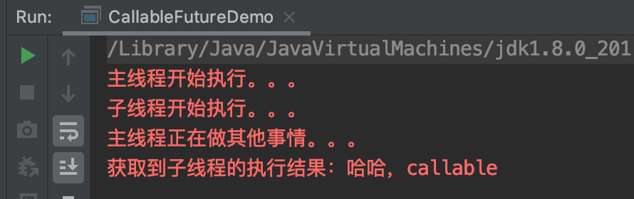
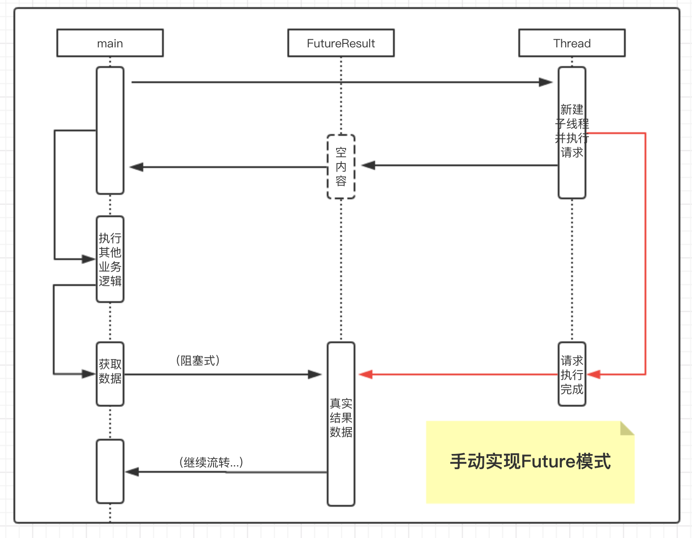
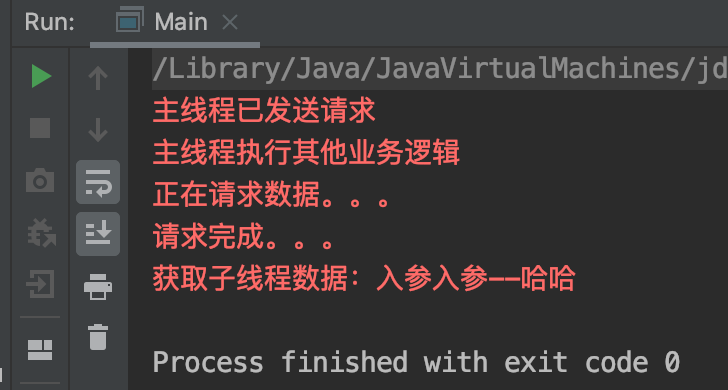
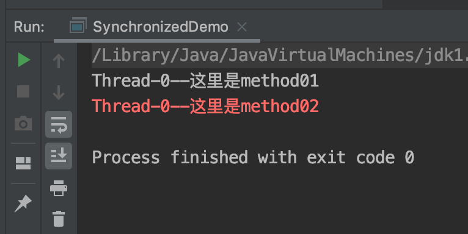
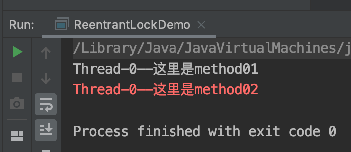
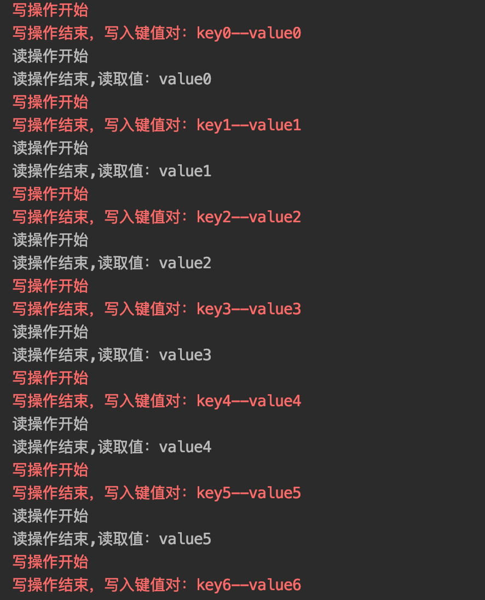
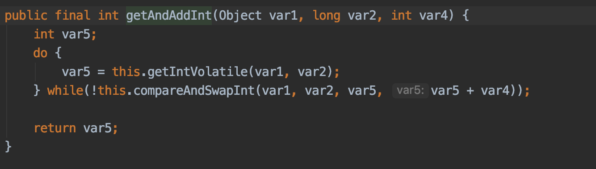

## 05. Callable与锁的深化
### 0. 导读  
1. Callable与Future模式
1. Future模式探究
1. 锁的深化
    1. 可重入锁
    1. 读写锁
    1. 悲观锁与乐观锁

### 1. Callable与Future（相关代码放置在future包下）
在Java中，创建线程一般有两种方式，一种是继承Thread类，一种是实现Runnable接口。然而，这两种方式的缺点是在线程任务执行结束后，无法获取执行结果。
我们一般只能采用共享变量或共享存储区以及线程通信的方式实现获得任务结果的目的。其实Java也提供了使用Callable和Future来实现获取任务结果的操作。
Callable用来执行任务，产生结果，而Future用来获得结果。  
代码演示：  
```java
public class CallableFutureDemo {
    public static void main(String[] args) throws ExecutionException, InterruptedException {
        ExecutorService executorService = Executors.newCachedThreadPool();
        Future<String> submit = executorService.submit(new CallableThread());
        System.err.println("主线程开始执行。。。");
        System.err.println("主线程正在做其他事情。。。");
        String s = submit.get();
        System.err.println("获取到子线程的执行结果："+s);
    }
}

class CallableThread implements Callable<String>{

    @Override
    public String call() throws Exception {
        System.err.println("子线程开始执行。。。");
        Thread.sleep(2000);
        return "哈哈，callable";
    }
}
```
  
    
### 2. Future模式探究（相关代码放置在handwrite包下）
Future模式的核心在于：去除了主函数的等待时间，并使得原本需要等待的时间段可以用于处理其他业务逻辑。
对于多线程，如果线程A要等待线程B的结果，那么线程A没必要等待B，可以先拿到一个未来的Future，等B有结果是再取真实的结果。  
Future模式底层使用wait()与notify()机制实现的，现在我们来手动实现一个简略版：  
1. 主线程新建子线程并执行，子线程立即给主线程返回空对象，并开始执行真正的业务（请求），此时子线程与主线程持有的结果引用执行同一个结果对象
（结果对象包含一个boolean类型的标志位(true已有结果、false未有结果)与一个真实的结果实体）。
1. 主线程继续流转，用到结果时，调用Future的get方法，get根据标志位判断，如果未有结果，则调用wait()方法进入阻塞。于此同时，子线程执行完毕后，更新标志位，写入数据，调用notify()方法唤醒主线程
（理想情况下，主线程在子线程执行完成之后再读取数据，这样就不会需要阻塞或唤醒）
1. 执行逻辑如图：   
   
1. 执行效果：  
 

### 3. 锁的深化（相关代码放置在lock下）
1. 可重入锁
    1. 重入锁，也叫做递归锁，指的是针对同一线程，外层函数获得锁之后 ，内层递归函数仍然可以获取该锁；
    1. Java原生提供了synchronized（重量级） 和 ReentrantLock(轻量级)等等重入锁
    1. synchronized代码示意：  
       ```java
       public class SynchronizedDemo {
       
           public static void main(String[] args) {
               new Thread(new cn.zephyr.lock.SyncThread()).start();
           }
       }
       
       class SyncThread implements Runnable{
       
           @Override
           public void run() {
               method02();
           }
       
           /**
            * 持有this锁
            */
           public synchronized void method01(){
               System.out.println(Thread.currentThread().getName()+"--"+"这里是method01");
       
           }
           /**
            * 持有this锁，内部调用添加this锁的方法（如果不可重入则会死锁）
            */
           public synchronized void method02(){
               method01();
               System.err.println(Thread.currentThread().getName()+"--"+"这里是method02");
           }
       }
       ```  
         
    1. ReentrantLock代码示意：  
        ```java
        public class ReentrantLockDemo {
        
            public static void main(String[] args) {
                new Thread(new Thread01()).start();
            }
        }
        
        class Thread01 implements Runnable{
        
            ReentrantLock reentrantLock = new ReentrantLock();
        
            @Override
            public void run() {
                method02();
            }
        
            public void method01(){
                try {
                    reentrantLock.lock();
                    System.out.println(Thread.currentThread().getName()+"--这里是method01");
                } finally {
                    reentrantLock.unlock();
                }
            }
        
            public void method02(){
                try {
                    reentrantLock.lock();
                    method01();
                    System.err.println(Thread.currentThread().getName()+"--这里是method02");
                } finally {
                    reentrantLock.unlock();
                }
            }
        }
        ```
         
1. 读写锁
    1. 在没有写操作的时候，两个线程同时读一个资源没有任何问题，所以应该允许多个线程能在同时读取共享资源。但是如果有一个线程想去写这些共享资源，就不应该再有其它线程对该资源进行读或写
    1. 读-读能共存，读-写不能共存，写-写不能共存
    1. 案例：给本地缓存的读写方法加上读写锁。代码示意： 
        ```java
        public class ReadWriteLockDemo {
            
            public static void main(String[] args) {
                MyCache myCache = new MyCache();
                new Thread(new Runnable() {
                    @Override
                    public void run() {
                        for (int i = 0; i < 10; i++) {
                            try {
                                Thread.sleep(100);
                            } catch (InterruptedException e) {
                                e.printStackTrace();
                            }
                            MyCache.write("key"+i,"value"+i);
                        }
                    }
                }).start();
                new Thread(new Runnable() {
                    @Override
                    public void run() {
                        for (int i = 0; i < 10; i++) {
                            try {
                                Thread.sleep(100);
                            } catch (InterruptedException e) {
                                e.printStackTrace();
                            }
                            MyCache.read("key"+i);
                        }
                    }
                }).start();
            }
        }
        
        class MyCache{
            private static Map<String,String> globalCache = new HashMap<String, String>();
        
            private static ReentrantReadWriteLock reentrantReadWriteLock = new ReentrantReadWriteLock();
            private static ReentrantReadWriteLock.ReadLock readLock = reentrantReadWriteLock.readLock();
            private static ReentrantReadWriteLock.WriteLock writeLock = reentrantReadWriteLock.writeLock();
            
            public static String read(String key){
                String s;
                try {
                    readLock.lock();
                    System.out.println("读操作开始");
                    s = globalCache.get(key);
                    System.out.println("读操作结束,读取值："+s);
                } finally {
                    readLock.unlock();
                }
                return s;
            }
            
            public static void write(String key,String value){
                try {
                    writeLock.lock();
                    System.err.println("写操作开始");
                    globalCache.put(key,value);
                    System.err.println("写操作结束，写入键值对："+key+"--"+value);
                } finally {
                    writeLock.unlock();
                }
            }
        }
        ```    
         
1. 悲观锁：总是假设最坏的情况，每次取数据时都认为其他线程会修改，所以都会加锁（读锁、写锁、行锁等），当其他线程想要访问数据时，都需要阻塞挂起。（synchronized、lock都是悲观锁）
1. 乐观锁：总是认为不会产生并发问题，每次去取数据的时候总认为不会有其他线程对数据进行修改，因此不会上锁，但是在更新时会判断其他线程在这之前有没有对数据进行修改，
一般会使用 __版本号机制__ 或 __CAS无锁机制__ 实现。（无锁，无阻塞无等待，只是有重试机制；AtomicInteger等原子类底层就是使用了乐观锁）
    1. CAS无锁机制(CAS：Compare and Swap，比较再交换。)的乐观锁：
        1. 无锁的好处：
           1. 在高并发的情况下，它比有锁的程序拥有更好的性能；
           1. 它天生就是死锁免疫的。
        1. CAS算法的过程是这样：它包含三个参数CAS(V,E,N): V表示要更新的变量(相当于版本号机制下的变量version)，E表示预期值（即原始值，旧值），N表示新值。仅当V值等于E值时，才会将V的值设为N，
        如果V值和E值不同，则说明已经有其他线程做了更新，则当前线程什么都不做。最后，CAS返回当前V的真实值。
        1. CAS的伪代码可以表示为：
            ```
                do{   
                   备份旧数据；  
                   基于旧数据构造新数据；  
                }while(!CAS( 内存地址，备份的旧数据，新数据 )); 
            ``` 
        1. 缺点：
            CAS存在一个很明显的问题，即ABA问题。如果变量V初次读取的时候是A，并且在准备赋值的时候检查到它仍然是A，那能说明它的值没有被其他线程修改过了吗？如果在这段期间曾经被改成B，
            然后又改回A，那CAS操作就会误认为它从来没有被修改过。针对这种情况，java并发包中提供了一个带有标记的原子引用类AtomicStampedReference，它可以通过控制变量值的版本来保证CAS的正确性
        1. 中自增操作getAndIncrement()的源码实现：  
              
    1. 版本号机制的乐观锁
        1. 版本号机制的基本思路是在数据中增加一个字段version，表示该数据的版本号，每当数据被修改，版本号加1。当某个线程查询数据时，将该数据的版本号一起查出来；
        当该线程更新数据时，判断当前版本号与之前读取的版本号是否一致，如果一致才进行操作。（version变量作为判断数据变化的标记，实际业务环境中可以使用时间戳的变量）  
           举一个简单的例子：  
           假设数据库中帐户信息表中有一个 version 字段，当前值为 1 ；而当前帐户余额字段（ balance ）为 $100 。
           1. 操作员 A 此时将其读出（ version=1 ），并从其帐户余额中扣除 $50（ $100-$50 ）。
           1. 在操作员 A 操作的过程中，操作员B 也读入此用户信息（ version=1 ），并从其帐户余额中扣除 $20 （ $100-$20 ）。
           1. 操作员 A 完成了修改工作，将数据版本号加一（ version=2 ），连同帐户扣除后余额（ balance=$50 ），提交至数据库更新，此时由于提交数据版本大于数据库记录当前版本，
           数据被更新，数据库记录 version 更新为 2 。
           1. 操作员 B 完成了操作，也将版本号加一（ version=2 ）试图向数据库提交数据（ balance=$80 ），但此时比对数据库记录版本时发现，操作员 B 提交的数据版本号为 2 ，
           数据库记录当前版本也为 2 ，不满足 “ 提交版本必须大于记录当前版本才能执行更新 “ 的乐观锁策略，因此，操作员 B 的提交被驳回。  
           这样，就避免了操作员 B 用基于 version=1 的旧数据修改的结果覆盖操作员A 的操作结果的可能。
           
### 4. Q&A：
1. 重量级锁与轻量级锁的区别？  
    轻量级锁的目标是，减少无实际竞争情况下，使用重量级锁产生的性能消耗；（占用资源少）  
    内置锁在Java中被抽象为监视器锁，同步方式的成本非常高，包括系统调用引起的内核态与用户态切换、线程阻塞造成的线程切换等。（非常占资源）
1. 读写锁的机制与原理？  
    [深入理解读写锁ReentrantReadWriteLock](https://juejin.im/post/5aeb0e016fb9a07ab7740d90)
1. 既然CAS包含了Compare和Swap两个操作，它又如何保证原子性呢？  
    CAS是由CPU支持的原子操作，其原子性是在硬件层面进行保证的。
    
### 5. 参考
> [【BAT面试题系列】面试官：你了解乐观锁和悲观锁吗？](https://www.cnblogs.com/kismetv/p/10787228.html)