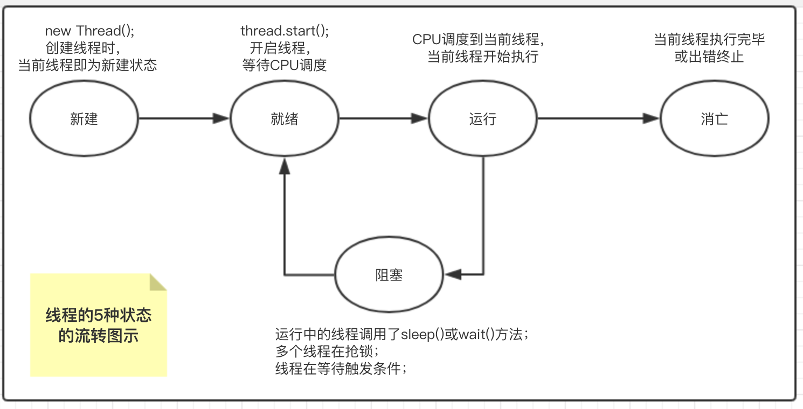

## 01 多线程基础
1. 进程与线程 
    每个正在系统上运行的程序都是一个进程。进程是所有线程的集合，每一个线程是进程中的一条执行路径。
1. 线程的使用场景  
    短信群发、多任务下载
1. 常见的线程创建的3种方式
    1. 继承Thread类(不推荐)
        ```java
        // 线程类
        public class ThreadDemo01 extends Thread{
            @Override
            public void run() {
                for (int i = 0; i < 30; i++) {
                   // do something
                }
            }
        }
        ```
        ``` java
           new ThreadDemo01().start();
        ```
    1. 实现Runnable接口
        ```java
        // 线程类
        public class ThreadDemo02 implements Runnable {
            @Override
            public void run() {
               // do something
            }
        }
        ```
        ``` java
        // 新建线程并启动
        ThreadDemo02 threadDemo02 = new ThreadDemo02();
        new Thread(threadDemo02).start();
        ```
    1. 匿名内部类
       ``` java
       // 新建线程并启动
       new Thread(new Runnable() {
           @Override
           public void run() {
               for (int i = 0; i < 10; i++) {
                    // do something
               }
           }
       }).start();
       ```
1. 线程的5种状态
    1. 新建：当用new操作符创建一个线程时;
    1. 就绪：手动调用thread.start()方法，等待CPU调度
    1. 运行：CPU调度到当前线程，则为运行状态
    1. 阻塞：手动调用sleep()、wait()方法，或多个线程抢锁时
    1. 死亡：当前线程执行完毕
    1. 线程各状态的流转图示：   
        
1. 守护线程
    1. 概念：与主线程共存亡，主线程消亡时守护线程也同时消亡。GC线程是JVM中典型的守护线程
    1. 用户线程（代码里new的线程）不是守护线程，主线程宕机或者消亡时，用户线程如果继续执行不受影响
    1. 将线程设定为守护线程的方式
        ``` java
        thread.setDaemon(true);
        ```
1. 线程优先级与join()、yield()方法
    1. 线程优先级
        1. Java中的线程优先级从低到高一共有1~10个优先级，jdk8提供了3个常量：MIN_PRIORITY = 1、NORM_PRIORITY = 5、MAX_PRIORITY = 10
        1. 高优先级的线程比低优先级的线程有更高的几率得到执行，这与操作系统版本相关，有可能即使设置了线程的优先级也不会产生任何作用。
        1. 设置线程优先级的方式：  
            ``` java
            // 方式一
            thread.setPriority(1);
            // 方式二
            Thread.currentThread().setPriority(1);
            ```
    1. join()方法（thread对象方法）
        1. 作用：把当前线程A的CPU时间让给join()方法对应的线程B,B执行完之后，再回来执行A
        1. 使用：  
            ``` java
               thread01.join();
            ```
    1. yield()方法（Thread类静态方法）
        1. Thread.yield()方法的作用：暂停当前正在执行的线程，并执行其他线程。（可能没有效果）
        1. 使用：  
            ``` java
               Thread.yield();
            ```