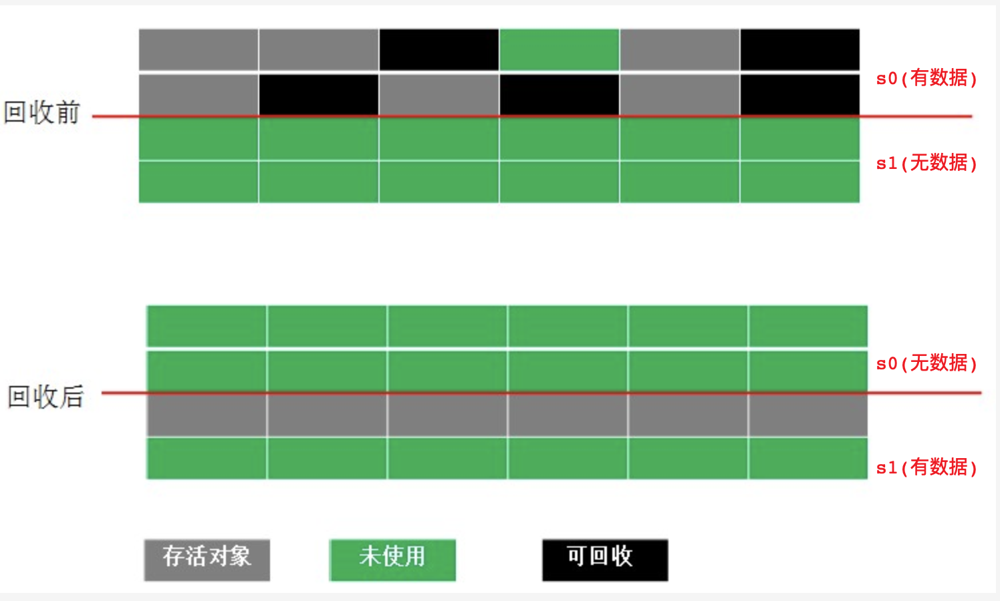
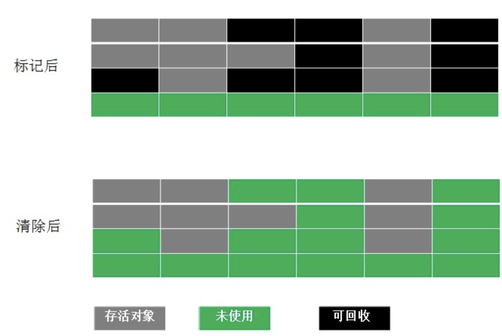
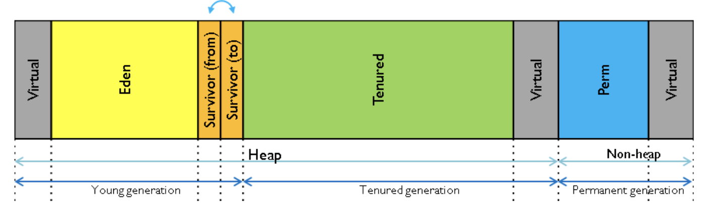

## 11. Java内存结构与GC垃圾回收算法
### 1. Java内存结构
1. JVM内存结构主要有三大块：堆内存、方法区和栈。堆内存是JVM中最大的一块由年轻代和老年代组成，而年轻代内存又被分成三部分，Eden空间、From Survivor空间、To Survivor空间,默认情况下年轻代按照8:1:1的比例来分配；
1. JVM和系统调用间的关系：  
    
1. 核心组件：
    1. Java堆（Java Heap）  
        java堆是java虚拟机所管理的内存中最大的一块，是被所有线程共享的一块内存区域，在JVM虚拟机启动时创建。此内存区域的 __唯一目的就是存放对象实例__，
        这一点在Java虚拟机规范中的描述是：__所有的对象实例以及数组都要在堆上分配__。  
        java堆是垃圾收集器管理的主要区域，因此也被成为“GC堆”（Garbage Collected Heap）。从内存回收角度来看，java堆大致可分为：新生代和老生代，再细致一点的有Eden空间、From Survivor空间、To Survivor空间等。
        从内存分配的角度看，线程共享的Java堆中可能划分出多个线程私有的分配缓冲区（Thread Local Allocation Buffer，TLAB）。
        无论怎么划分，都与存放内容无关，无论哪个区域，存储的都是对象实例，进一步的划分都是为了更好的回收内存，或者更快的分配内存。  
        根据Java虚拟机规范的规定，java堆可以处于物理上不连续的内存空间中。当前主流的虚拟机都是可扩展的（通过 -Xmx 和 -Xms 控制）。
        如果堆中没有内存完成实例分配，并且堆也无法再扩展时，将会抛出OutOfMemoryError异常（堆内存溢出）。
    1. 方法区（Method Area）  
        方法区与java堆一样，是各个线程共享的内存区域，它用于存储已被虚拟机加载的类信息、常量、静态变量、即时编译器编译后的代码等数据。它有个别命叫Non-Heap（非堆）。
        很多人愿意把方法区称为“永久代”（Permanent Generation），本质上两者并不等价，仅仅是因为HotSpot虚拟机的设计团队选择把GC分代收集扩展至方法区，或者说使用永久代来实现方法区而已。
        Java虚拟机规范对这个区域的限制非常宽松，除了和Java堆一样不需要连续的内存和可以选择固定大小或者可扩展外，还可以选择不实现垃圾收集。相对而言，垃圾收集行为在这个区域是比较少出现的，
        但并非数据进入了方法区就如永久代的名字一样“永久”存在了。这个区域的内存回收目标主要是针对常量池的回收和对类型的卸载，一般来说这个区域的回收“成绩”比较难以令人满意，尤其是类型的卸载，条件相当苛刻，但是这部分区域的回收确实是有必要的。  
        根据Java虚拟机规范的规定，当方法区无法满足内存分配需求时，将抛出OutOfMemoryError异常。 
    1. 程序计数器（Program Counter Register）  
        程序计数器是一块较小的内存空间，它可以看作是当前线程所执行的字节码的行号指示器。
        由于Java虚拟机的多线程是通过线程轮流切换并分配处理器执行时间的方式来实现的，一个处理器都只会执行一条线程中的指令。
        因此，为了线程切换后能恢复到正确的执行位置，__每条线程都有一个独立的程序计数器__，各个线程之间计数器互不影响，独立存储。称之为“线程私有”的内存。  
        程序计数器内存区域是虚拟机中唯一没有规定OutOfMemoryError情况的区域。
    1. VM栈（Virtual Machine Stacks）  
        （与程序计数器一样）虚拟机栈也是线程私有的，它的生命周期和线程相同。虚拟机栈描述的是Java方法执行的内存模型：
        每个方法在执行的同时都会创建一个栈帧（Stack Frame）用于存储局部变量表、操作数栈、动态链接、方法出口等信息。每一个方法被调用直至执行完成的过程，就对应着一个栈帧在虚拟机栈中从入栈到出栈的过程。 
        咱们常说的堆内存、栈内存中，栈内存指的就是虚拟机栈。局部变量表存放了编译期可知的各种基本数据类型（8个基本数据类型）、对象引用（地址指针）、returnAddress类型。  
        其中64位长度的long和double类型的数据会占用2个局部变量空间（Slot），其余的数据类型只占用1个。局部变量表所需的内存空间在编译期间完成分配，当进入一个方法时，这个方法需要在帧中分配多大的局部变量空间是完全确定的，在方法运行期间不会改变局部变量表的大小。  
        在Java虚拟机规范中，对这个区域规定了两种异常状况：如果线程请求的栈深度大于虚拟机所允许的深度，将抛出StackOverflowError异常；如果虚拟机栈可以动态扩展（当前大部分的Java虚拟机都可动态扩展，只不过Java虚拟机规范中也允许固定长度的虚拟机栈），当扩展时无法申请到足够的内存时会抛出OutOfMemoryError异常。
    1. 本地方法栈（Native Method Stack）  
        本地方法栈（Native Method Stacks）与虚拟机栈所发挥的作用是非常相似的，其区别不过是虚拟机栈为虚拟机执行Java方法（也就是字节码）服务，而本地方法栈则是为虚拟机使用到的Native方法服务。
        虚拟机规范中对本地方法栈中的方法使用的语言、使用方式与数据结构并没有强制规定，因此具体的虚拟机可以自由实现它。甚至有的虚拟机（譬如Sun HotSpot虚拟机）直接就把本地方法栈和虚拟机栈合二为一。  
        与虚拟机栈一样，本地方法栈区域也会抛出StackOverflowError和OutOfMemoryError异常。

### 2. GC垃圾回收算法分析
jvm 中，程序计数器、虚拟机栈、本地方法栈都是随线程而生随线程而灭，栈帧随着方法的进入和退出做入栈和出栈操作，实现了自动的内存清理，因此，我们的内存垃圾回收主要集中于 java 堆和方法区中，在程序运行期间，这部分内存的分配和使用都是动态的。
1. GC其实是一种自动的内存管理工具，其行为主要包括2步
    1. 在Java堆中，为新创建的对象分配空间
    1. 在Java堆中，回收没用的对象占用的空间
1. 这里就要描述一下堆内存的结构：  
    1. 首先堆内存大致可以分为4种区域
        1. 新生代区
            1. eden区
            1. s0区（from）、s1区（to）
        1. 老年代区   
        
    1. 通常情况下，对象会在新生代的Eden区中分配空间，如果GC判定当前对象比较常用，会将其转移到s0或s1区（至于是s0还是s1详见 __复制算法__），再然后如果GC判定当前对象使用次数较多（比常用还常用），就会将其移动到老年代区
1. 如何判断对象是否存活（由于循环引用的问题，一般采用跟踪（可达性分析）方法）
    1. 引用计数：每个对象有一个引用计数属性，新增一个引用时计数加1，引用释放时计数减1，计数为0时可以回收。此方法简单，缺点是无法解决对象相互循环引用的问题。
    1. 可达性分析（Reachability analysis）：从GC Roots开始向下搜索，搜索所走过的路径称为引用链。当一个对象到GC Roots没有任何引用链相连时，则证明此对象是不可用的，是不可达对象。  
        在Java语言中，可以作为GCRoots的对象包括下面几种：  
        1. 虚拟机栈（栈帧中的局部变量区，也叫做局部变量表）中引用的对象。
        1. 方法区中的类静态属性引用的对象。
        1. 方法区中常量引用的对象。
        1. 本地方法栈中JNI(Native方法)引用的对象。
1. 垃圾回收算法
    1. 标记 -清除算法  
        “标记-清除”（Mark-Sweep）算法，如它的名字一样，算法分为“标记”和“清除”两个阶段：首先标记出所有需要回收的对象，在标记完成后统一回收掉所有被标记的对象。
        之所以说它是最基础的收集算法，是因为后续的收集算法都是基于这种思路并对其缺点进行改进而得到的。
        它的主要缺点有两个：一个是效率问题，标记和清除过程的效率都不高；另外一个是空间问题，标记清除之后会产生大量不连续的内存碎片，空间碎片太多可能会导致，当程序在以后的运行过程中需要分配较大对象时无法找到足够的连续内存而不得不提前触发另一次垃圾收集动作。    
        
    1. 复制算法  
        如果jvm使用了coping算法，一开始就会将可用内存分为两块，from域和to域， 每次只是使用from域，to域则空闲着。当from域内存不够了，开始执行GC操作，这个时候，会把from域存活的对象拷贝到to域,然后直接把from域进行内存清理。  
        这样使得每次都是对其中的一块进行内存回收，内存分配时也就不用考虑内存碎片等复杂情况，只要移动堆顶指针，按顺序分配内存即可，实现简单，运行高效。只是这种算法的代价是将内存缩小为原来的一半，持续复制长生存期的对象则导致效率降低。  
        
    1. 标记-压缩算法  
        复制收集算法在对象存活率较高时就要执行较多的复制操作，效率将会变低。更关键的是，如果不想浪费50%的空间，就需要有额外的空间进行分配担保，以应对被使用的内存中所有对象都100%存活的极端情况，所以在老年代一般不能直接选用这种算法。
        根据老年代的特点，有人提出了另外一种“标记-整理”（Mark-Compact）算法，标记过程仍然与“标记-清除”算法一样，但后续步骤不是直接对可回收对象进行清理，而是让所有存活的对象都向一端移动，然后直接清理掉端边界以外的内存。    
        
    1. 分代收集算法

### 3. 细枝末节
1. HotSpotVM
1. 控制Java内存结构的JVM参数：   
    
    -Xms设置堆的最小空间大小。  
    -Xmx设置堆的最大空间大小。  
    -XX:NewSize设置新生代最小空间大小。  
    -XX:MaxNewSize设置新生代最大空间大小。  
    -XX:PermSize设置永久代最小空间大小。  
    -XX:MaxPermSize设置永久代最大空间大小。  
    -Xss设置每个线程的堆栈大小。  
    没有直接设置老年代的参数，但是可以设置堆空间大小和新生代空间大小两个参数来间接控制。  
      老年代空间大小=堆空间大小-年轻代大空间大小 
    
### 4. 参考
>[Spark（八）JVM调优以及GC垃圾收集器](https://www.cnblogs.com/frankdeng/p/9301798.html)
>[理解JVM（4）- 堆内存的分代管理](https://yq.aliyun.com/articles/308477?spm=a2c4e.11153940.0.0.5696766bIAdFhL&type=2)