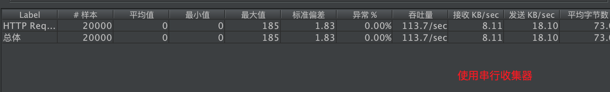

## 12. 垃圾收集器、JVM参数调优与性能测试工具
### 1. JVM参数配置
借用上一节提到JVM堆内存结构的图    
   
    1. -Xms:设置堆的最小空间大小(堆内存的初始化空间)。    
    1. -Xmx:设置堆的最大空间大小。  
    1. -XX:NewSize设置新生代最小空间大小。  
    1. -XX:MaxNewSize设置新生代最大空间大小。  
    1. -XX:PermSize设置永久代最小空间大小。  
    1. -XX:MaxPermSize设置永久代最大空间大小。  
    1. -Xss设置每个线程的堆栈大小（可用于扩大递归方法的递归深度）。 
    1. -XX:+PrintGC 每次触发GC的时候打印相关日志
    1. -XX:+UseSerialGC 串行回收
    1. -XX:+PrintGCDetails 更详细的GC日志 
案例：首先查看堆内存信息（使用如下配置```-Xmx40m -Xms10m ```），再使用大约20M的内存空间，查看已使用的内存空间是否有变化：  
```java
public class ShowJvmMemoryInfoDemo {

    public static void main(String[] args) {
        System.err.println("最大内存"+Runtime.getRuntime().maxMemory()/1024/1024+"M");
        System.err.println("可使用内存"+Runtime.getRuntime().freeMemory()/1024/1024+"M");
        System.err.println("(创建对象前)已使用内存"+Runtime.getRuntime().totalMemory()/1024/1024+"M");
        // 新创建的对象总计占用大约20M的内存空间
        for (int i = 0; i < 10; i++) {
            byte[] b = new byte[1024*1024*2];
        }
        System.out.println("(创建对象后)已使用内存"+Runtime.getRuntime().totalMemory()/1024/1024+"M");
    }
}
```    
控制台输出（可以看到"已使用内存"的已扩大到对应数值）：  
```text
最大内存36M
可使用内存8M
(创建对象前)已使用内存9M
(创建对象后)已使用内存24M
```  
Xms如果不够用，会一边进行垃圾回收，一边额外申请新的堆内存空间（将Xms与Xmx配置成一样的数值可以减少系统在垃圾回收上的性能消耗）

### 1. 内存溢出问题
1. ```java.lang.OutOfMemoryError```与```java.lang.StackOverflowError```的区别
    1. ```java.lang.OutOfMemoryError```是堆内存溢出（实际使用的内存数值高于设定的最大堆内存数值），JVM参数层面的解决方案是调大-Xmx  
        ```java
        public class OutOfMemoryDemo {
            // 基于-Xmx10m
            public static void main(String[] args) {
                List<Object> listObject = new ArrayList<Object>();
                // 新创建的对象总计占用至少20M的内存空间，而最大内存空间是10M
                for (int i = 0; i < 10; i++) {
                    byte[] b = new byte[1024*1024*2];
                    listObject.add(b);
                }
            }
        }
        ```
        ```text
        Exception in thread "main" java.lang.OutOfMemoryError: Java heap space
        	at cn.zephyr.memory.OutOfMemoryDemo.main(OutOfMemoryDemo.java:18)
        ```
        调大```-Xmx```参数即可（当前示例中还需考虑List对象占用了较大空间）
    1. ```java.lang.StackOverflowError```是栈内存溢出，通常发生在（不合理的）递归调用中
        ```java
        public class StackOverFlowDemo {
            // 递归深度计数器
            private static Integer counter=0;
            // -Xss1m的递归深度：11641；-Xss5m的递归深度：63267
            public static void main(String[] args) {
                try {
                    count();
                } catch (Throwable t) {
        //            t.printStackTrace();
                }finally {
                    System.err.println("递归深度："+counter);
                }
            }
        
            private static void count(){
                counter++;
                count();
            }
        }
        ```  
        当设置-Xss1m时，递归深度是11641；设置-Xss5m的递归深度：63267
1. 内存溢出与内存泄漏的区别  
    Java内存泄漏就是没有及时清理内存垃圾，导致系统无法再给你提供内存资源（内存资源耗尽，就像倒水倒多了，从杯子上面溢出了来了一样。）；
    而Java内存溢出就是你要求分配的内存超出了系统能给你的，系统不能满足需求，于是产生溢出（使用过的内存空间没有被及时释放，长时间占用内存，最终导致内存空间不足，而出现内存溢出）。

### 1. 垃圾收集器与JMeter测试
1. 串行与并行收集器
   1. 串行回收（单线程回收）: JDK1.5前的默认算法 缺点是只有一个线程，执行垃圾回收时程序停止的时间比较长
   1. 并行回收（多线程回收）: 多个线程执行垃圾回收适合于吞吐量的系统，回收时系统会停止运行
1. 各种收集器：   
    1. __串行收集器__:是最古老、最稳定以及效率高的收集器，可能会产生较长的停顿，只使用一个线程去回收。垃圾收集的过程中会Stop The World（服务暂停）  
        特点：CPU利用率最高，停顿时间即用户等待时间比较长。  
        适用场景：小型应用    
        通过JVM参数```-XX:+UseSerialGC```可以使用串行垃圾回收器。  
    1. __ParNew收集器__：其实就是Serial收集器的多线程版本。新生代并行，老年代串行；
       参数控制：```-XX:+UseParNewGC```
    1. __parallel收集器__：Parallel收集器类似ParNew收集器，Parallel收集器更关注系统的吞吐量。可以通过参数来打开自适应调节策略，
    虚拟机能根据当前系统的运行情况收集性能监控信息，动态调整这些参数以提供最合适的停顿时间或最大的吞吐量；也可以通过参数控制GC的时间不大于多少毫秒或者比例；  
        特点：停顿时间短，回收效率高，对吞吐量要求高。  
        适用场景：大型应用，科学计算，大规模数据采集等。  
        通过JVM参数 ```-XX:+UseParallelGC``` 打开并发标记扫描垃圾回收器，使用```-XX:ParallelGCThreads=...```指定并行线程数。
    1. __CMS（Concurrent Mark Sweep）收集器__：是一种以获取最短回收停顿时间为目标的收集器。是基于“标记-清除”算法实现的，它的运作过程相对于前面几种收集器来说要更复杂一些，整个过程分为4个步骤，包括： 
       1. 初始标记（CMS initial mark）
       1. 并发标记（CMS concurrent mark）
       1. 重新标记（CMS remark）
       1. 并发清除（CMS concurrent sweep）    
       其中初始标记、重新标记这两个步骤仍然需要“Stop The World”。初始标记仅仅只是标记一下GC Roots能直接关联到的对象，速度很快，并发标记阶段就是进行GC Roots Tracing的过程，
       而重新标记阶段则是为了修正并发标记期间，因用户程序继续运作而导致标记产生变动的那一部分对象的标记记录，这个阶段的停顿时间一般会比初始标记阶段稍长一些，但远比并发标记的时间短。
       由于整个过程中耗时最长的并发标记和并发清除过程中，收集器线程都可以与用户线程一起工作，所以总体上来说，CMS收集器的内存回收过程是与用户线程一起并发地执行。
       特点：响应时间优先，减少垃圾收集停顿时间  
       适应场景：大型服务器等。  
       通过JVM参数 ```-XX:+UseConcMarkSweepGC``` 设置 
    1. __G1收集器__：在G1中，堆被划分成 许多个连续的区域(region)。采用G1算法进行回收，吸收了CMS收集器特点。
       特点：支持很大的堆，高吞吐量
            1. 支持多CPU和垃圾回收线程
            1. 在主线程暂停的情况下，使用并行收集
            1. 在主线程运行的情况下，使用并发收集  
        通过JVM参数 ```-XX:+UseG1GC``` 使用G1垃圾回收器
1. 使用Jmeter测试一下在使用各垃圾收集器下的QPS（springboot环境，JVM参数：```-Xmx100m -Xms10m -XX:+PrintGCDetails```（最大100M，初始化10M，输出GC详情），单线程连续请求10000次）
        
        
        
        
        
       
### 1. 其他知识点
1. 并发与并行的区别 
    并发是指一个处理器同时处理多个任务。   
    并行是指多个处理器或者是多核的处理器同时处理多个不同的任务。   
    并发是逻辑上的同时发生（simultaneous），而并行是物理上的同时发生。   
    来个比喻：并发是一个人同时吃三个馒头，而并行是三个人同时吃三个馒头。  