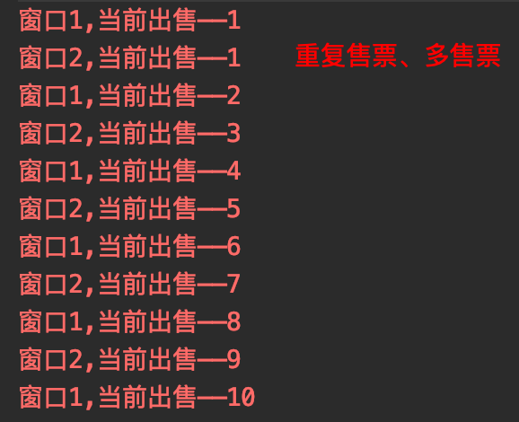

## 02. Java内存模型
1. 引入：火车票抢票问题（相关代码放在railway包下）
    1. 线程不安全的情况：售票方法未加锁，会出现重复售票、多售票的情况
        ```java
        public class ThreadNotSafe {
            public static void main(String[] args) {
                Thread01 thread1 = new Thread01();
                Thread thread01 = new Thread(thread1,"窗口1");
                Thread thread02 = new Thread(thread1,"窗口2");
                thread01.start();
                thread02.start();
            }
        }
        class Thread01 implements  Runnable{
        
            private Integer count=10;
        
            @Override
            public void run() {
                try {
                    Thread.sleep(10);
                } catch (InterruptedException e) {
                    e.printStackTrace();
                }
                while(count>0)
                    sale();
            }
        
            private void sale(){
                // 有必要在此处进行判断
                if(count>0)
                    System.err.println(Thread.currentThread().getName()+",当前出售——"+(10-count--+1) );
            }
        }
        ```  
          
   1. 线程安全的情况：给售票的方法加锁，有且只能单条线程访问售票方法  
        ``` java
            private synchronized void sale(){
                // 有必要在此处进行判断
                if(count>0)
                    System.err.println(Thread.currentThread().getName()+",当前出售——"+(10-count--+1) );
            }
        ```  
          
1. 什么是线程安全问题：  
    多个线程共享一个全局变量，在进行对该变量进行写操作的时候，可能会引发线程安全问题（读操作不会引发）
1. 如何解决多线程之间线程安全问题:  
    使用多线程之间同步(synchronized，内置锁，自动挡)或使用锁(lock，手动挡)。这2种机制能让当前唯一个线程进行执行。代码执行完成后释放锁，然后才能让其他线程进行执行。这样的话就可以解决线程不安全问题。
1. synchronized的3种使用方式(相关代码放在sync包下)
    1. 同步代码块：注意各线程实例一定要持有同一个锁对象（不能持有各自的锁对象）
    1. 非静态同步方法：任意对象作为锁
    1. 静态同步方法：字节码文件（class文件）作为锁
1. 死锁(相关代码放在deadlock包下)   
    1. 同步(synchronized)中嵌套同步(synchronized)，多个线程互相持有对方的锁，并同时等待对方释放锁，导致锁无法释放；
    1. 在实际使用中一定要注意避免同步(synchronized)互相嵌套的情况
    1. (补充)重入锁：可重复可递归调用的锁，在外层使用锁之后，在内层仍然可以使用，并且不发生死锁（这里的锁指的是同一个锁对象）；synchronized锁是重入锁
    1. 代码示例： 
        ```java
        public class DeadLockThread {
            public static void main(String[] args) {
                Thread1 thread1 = new Thread1();
                Thread thread01 = new Thread(thread1);
                Thread thread02 = new Thread(thread1);
                thread01.start();
                thread02.start();
            }
        }
        
        class Thread1 implements Runnable{
            private Integer count=100;
            
            private final Object obj= new Object();
        
            @Override
            public void run() {
                while(count>0){
                    if(count%2==0){
                        // 重入锁
                        // 先持有obj锁，后持有this锁
                        synchronized (obj){
                            sale();
                        }
                    }else{
                        // 先持有this锁，后持有obj锁
                        sale();
                    }
                }
            }
        
            private synchronized void sale(){
                synchronized (obj){
                    System.err.println(Thread.currentThread().getName()+"--方法--"+(100-count+1));
                    count--;
                }
            }
        }
        ```  
          
1. ThreadLocal（相关代码放在threadlocal包下）
    1. ThreadLocal是一个关于创建线程局部变量的类。通常情况下，我们创建的变量是可以被任何一个线程访问并修改的。而使用ThreadLocal创建的变量只能被当前线程访问，其他线程则无法访问和修改.
    1. 代码示例：
        ```java
        public class ThreadlocalDemo {
            public static void main(String[] args) {
                Thread05 thread = new Thread05();
                Thread thread1 = new Thread(thread);
                Thread thread2 = new Thread(thread);
                thread1.start();
                thread2.start();
            }
        }
        
        class Thread05 implements  Runnable{
        
            private ThreadLocal<Integer> threadLocal = new ThreadLocal<Integer>(){
                // 设定初始值
                @Override
                protected Integer initialValue() {
                    return 0;
                }
            };
            @Override
            public void run() {
                for (int i = 0; i < 3; i++) {
                    System.err.println(Thread.currentThread().getName()+"----"+getCount());
                }
            }
        
            private synchronized Integer getCount(){
                Integer count = threadLocal.get();
                threadLocal.set(++count);
                return count;
            }
        }
        ```  
          
    1. 实际上ThreadLocal的值是放入了当前线程的一个ThreadLocalMap实例中，key是当前线程，value是对应值
1. 多线程的3大特性
    1. 原子性（线程安全问题）：一个完整的操作可能会包含多个步骤，要么所有步骤全部执行，要么就一个步骤都不执行，不能出现一个操作执行到一半被打断的情况；
    1. 可见性（volatile）：当多个线程访问同一个变量时，一个线程修改了这个变量的值，其他线程能够立即看得到修改的值；
    1. 有序性（重排序）：程序执行的顺序按照代码的先后顺序执行，处理器为了提高程序运行效率，可能会对输入代码进行优化，它不保证程序中各个语句的执行先后顺序同代码中的顺序一致，
    但是它会保证程序最终执行结果和代码顺序执行的结果是一致的。重排序对单线程运行是不会有任何问题，而多线程就不一定了。
1. Java内存模型（Java Memory Model,JMM）
    Java内存模型(简称JMM)决定一个线程对共享变量的写入时,能对另一个线程可见。JMM定义了线程和主内存之间的抽象关系：线程之间的共享变量存储在主内存（main memory）中，每个线程都有一个私有的本地内存（local memory），
    本地内存中存储了该线程以读/写共享变量的副本。当多个线程同时访问一个数据的时候，可能本地内存没有及时刷新到主内存，所以就会发生线程安全问题；
    本地内存是JMM的一个抽象概念，并不真实存在。它涵盖了缓存，写缓冲区，寄存器以及其他的硬件和编译器优化。
      
1. volatile关键字(相关代码放在vola包下)   ：
    1. 可见性也就是说一旦某个线程修改了该被volatile修饰的变量，它会保证修改的值会立即被更新到主存，当有其他线程需要读取时，可以立即获取修改之后的值。
    1. 在Java中为了加快程序的运行效率，对一些变量的操作通常是在该线程的寄存器或是CPU缓存上进行的，之后才会同步到主存中，而加了volatile修饰符的变量则是直接读写主存。
    1. 只能解决可见性问题，不能解决原子性问题，不能解决线程安全问题
    1. 禁止"指令重排序优化"（什么是指令重排序：是指CPU采用了允许将多条指令不按程序规定的顺序分开发送给各相应电路单元处理，旨在提高程序运行效率），volatile修饰的变量在赋值后，会额外添加一个内存屏障（指令重排序时不能把后面的指令重排序到内存屏障之前的位置）。
    1. 性能：volatile 的读性能消耗与普通变量几乎相同，但是写操作稍慢，因为它需要在本地代码中插入许多内存屏障指令来保证处理器不发生乱序执行。
    1. 代码示例：
        ```java
        public class VolatileDemo {
            public static void main(String[] args) throws InterruptedException {
                Thread06 thread06 = new Thread06();
                Thread thread = new Thread(thread06);
                thread.start();
                Thread.sleep(2000);
                thread06.setFlag(true);
                Thread.sleep(2000);
            }
        }
        
        class Thread06 implements Runnable{
            // 不加volatile则程序无法停止
            private volatile Boolean flag = false;
        
            public void setFlag(Boolean flag) {
                this.flag = flag;
            }
        
            @Override
            public void run() {
                System.err.println("线程开始执行 ==》");
                while(!flag){}
                System.err.println("线程结束执行《==");
            }
        }   
        ```  
       
1. 重排序：
    1. 案例：起2个线程，互相交换值，理论上可能出现的结果是(1,0)、(0,1)、(1,1)，但是由于重排序的原因，还会有(0,0)的情况出现
    1. 代码示例：
        ```java
        public class ResortDemo {
        
            private static Integer a = 0,b = 0;
            private static Integer x = 0,y = 0;
        
            public static void main(String[] args) throws InterruptedException {
                do{
                    a=b=x=y=0;
                    Thread thread01 = new Thread(new Runnable() {
                        @Override
                        public void run() {
                            a = 1;  // 1
                            x = b;  // 2
                        }
                    });
                    Thread thread02 = new Thread(new Runnable() {
                        @Override
                        public void run() {
                            b = 1;  // 3
                            y = a;  // 4
                        }
                    });
                    thread01.start();
                    thread02.start();
                    thread01.join();thread02.join();
                    System.out.println("(" + x + "," + y + ")");
                }while(x!=0 || y!=0);
            }
        }
        ```  
          
    1. 定义：为了提高程序的执行效率，不具备数据依赖性的2个步骤，可能将不会被顺序执行； 
    1. 数据依赖性：如果两个操作访问同一个变量，且这两个操作中有一个为写操作，此时这两个操作之间就存在数据依赖性。     
    1. as-if-serial语义：  
        1. 不管怎么重排序（编译器和处理器为了提高并行度），（单线程）程序的执行结果不能被改变
        1. 案例：2数相加
            1. 代码：     
                ``` java    
                int a=1;    // 步骤A
                int b=2;    // 步骤B
                int c = a + b;  // 步骤C
                ```
            1. 依赖关系：C依赖于A、B，而A、B互不依赖
            1. 经过重排序之后又2种可能的执行路径：A->B->C、B->A->C  
    1. 程序排序规则：
        1. 根据Java内存模型中的规定，可以总结出以下几条happens-before规则，这些规则保证了happens-before前后两个操作不会被重排序且后者对前者的内存可见。
            1. 程序次序法则：线程中的每个动作A都happens-before于该线程中的每一个动作B，其中，在程序中，所有的动作B都能出现在A之后。
            1. 监视器锁法则：对一个监视器锁的解锁 happens-before于每一个后续对同一监视器锁的加锁。
            1. volatile变量法则：对volatile域的写入操作happens-before于每一个后续对同一个域的读写操作。
            1. 线程启动法则：在一个线程里，对Thread.start的调用会happens-before于每个启动线程的动作。
            1. 线程终结法则：线程中的任何动作都happens-before于其他线程检测到这个线程已经终结、或者从Thread.join调用中成功返回，或Thread.isAlive返回false。
            1. 中断法则：一个线程调用另一个线程的interrupt happens-before于被中断的线程发现中断。
            1. 终结法则：一个对象的构造函数的结束happens-before于这个对象finalizer的开始。
            1. 传递性：如果A happens-before于B，且B happens-before于C，则A happens-before于C
        1. 根据happens-before的程序顺序规则，上面2数相加的示例代码存在三个happens-before关系：  
            1. A happens-before B；
            1. B happens-before C；
            1. A happens-before C；  
        1. 如果A happens- before B，JMM并不要求A一定要在B之前执行。JMM仅仅要求前一个操作（执行的结果）对后一个操作可见，
        且前一个操作（执行的结果）按顺序排在第二个操作之前。这里操作A的执行结果不需要对操作B可见；而且重排序操作A和操作B后的执行结果，与操作A和操作B按happens- before顺序执行的结果一致。
        在这种情况下，JMM会认为这种重排序并不非法（not illegal），JMM允许这种重排序 
            
> 参考：  
>[美团技术博客](https://tech.meituan.com/2014/09/23/java-memory-reordering.html)    
>《Java并发编程实战》
>[深入理解 Java 内存模型（二）——重排序](https://www.infoq.cn/article/java-memory-model-2/)
 
> todo：  
synchronized底层 实现原理（monitor）  
JVM内存结构：堆、栈、方法区、寄存器